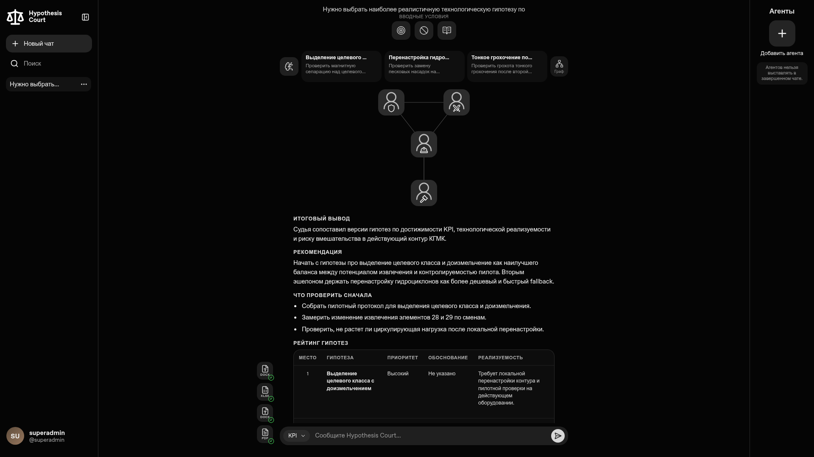
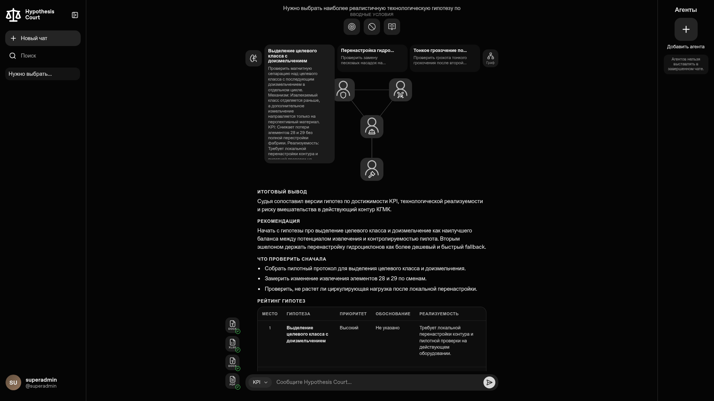
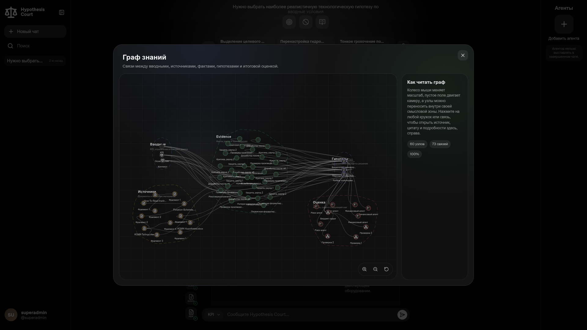
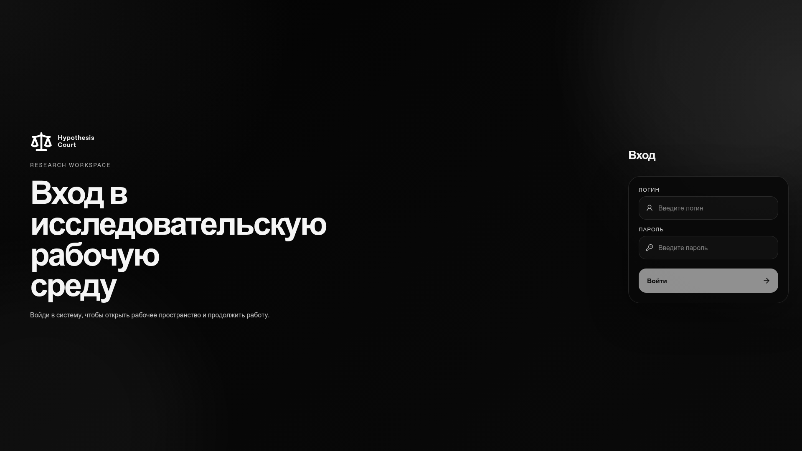
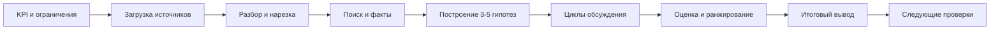
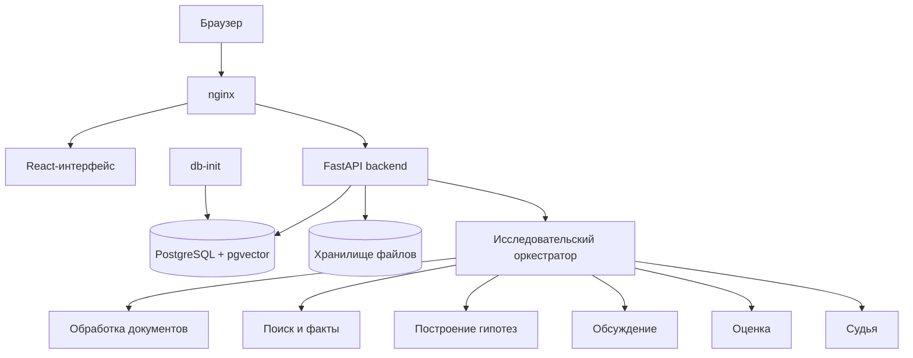

# Hypothesis Court

<p align="center">
  Платформа для исследовательских сессий, в которой KPI, ограничения и исходные материалы превращаются в набор гипотез, обсуждение, оценку и итоговую рекомендацию.
</p>

<p align="center">
  
  
  
  
</p>

<p align="center">
  
</p>

<p align="center">
  Исследовательская сессия • Работа с фактами и ограничениями • Цикл обсуждения гипотез • Граф знаний • Итоговая оценка
</p>

<p align="center">
  <a href="#что-это">Что это</a> •
  <a href="#галерея">Галерея</a> •
  <a href="#как-работает-проект">Как это работает</a> •
  <a href="#архитектура">Архитектура</a> •
  <a href="#быстрый-запуск">Запуск</a> •
  <a href="#как-проект-развивался">История</a>
</p>

<table>
  <tr>
    <td align="center"><strong>3-5</strong><br>стартовых гипотез</td>
    <td align="center"><strong>5</strong><br>слоев исследовательского контура</td>
    <td align="center"><strong>10+</strong><br>поддерживаемых форматов источников</td>
    <td align="center"><strong>1</strong><br>рабочая среда для фактов, обсуждения и вывода</td>
  </tr>
</table>

## Что это

**Hypothesis Court** — система для исследовательских и инженерных команд, которым нужно работать с задачей, источниками, гипотезами и итоговой оценкой в рамках одной сессии.

В проекте:

- пользователь формулирует `KPI`, ограничения и контекст;
- загружает документы, таблицы, PDF и изображения;
- получает набор фактов и ограничений, привязанный к источникам;
- видит стартовый набор из `3-5` гипотез;
- наблюдает цикл обсуждения по каждой гипотезе;
- получает независимую оценку, ранжирование и итоговый вывод;
- может открыть граф знаний и проследить путь от исходников до рекомендации.

Результат одной исследовательской сессии:

- постановка задачи;
- набор загруженных источников;
- набор фактов, рисков и ограничений;
- стартовый набор гипотез;
- версии гипотез после обсуждения;
- история обсуждения;
- результаты оценки;
- ранжирование вариантов;
- итоговая рекомендация.

## Чем проект силен

<table>
  <tr>
    <td width="33%"><strong>Опора на источники</strong><br>Гипотезы связаны с конкретными фрагментами документов, а не только с итоговым текстом модели.</td>
    <td width="33%"><strong>Ролевое обсуждение</strong><br>Каждая гипотеза проходит через защиту, критику и проверку реализуемости.</td>
    <td width="33%"><strong>Прозрачность хода работы</strong><br>Пользователь видит не только итог, но и путь от вводных данных до ранжирования.</td>
  </tr>
  <tr>
    <td width="33%"><strong>Граф знаний</strong><br>Связывает вводные, файлы, факты, гипотезы, оценки и следующий шаг.</td>
    <td width="33%"><strong>Версии исследований</strong><br>Позволяет хранить и переключать версии исследования внутри одной сессии.</td>
    <td width="33%"><strong>Управление настройками</strong><br>Позволяет настраивать пользователей, текстовый провайдер и провайдер эмбеддингов через интерфейс.</td>
  </tr>
</table>

## Галерея

<table>
  <tr>
    <td colspan="2">
      
    </td>
  </tr>
  <tr>
    <td align="center">Общий вид рабочей среды: карточки гипотез, сцена, итоговый вывод, ранжирование и обработанные вложения</td>
    <td align="center">Локальный запуск проекта на кейсе хвостов КГМК</td>
  </tr>
  <tr>
    <td>
      
    </td>
    <td>
      
    </td>
  </tr>
  <tr>
    <td align="center">Предпросмотр гипотезы с кратким механизмом, связью с KPI и оценкой реализуемости</td>
    <td align="center">Граф знаний: вводные, источники, факты, гипотезы и итоговый вывод в одной схеме</td>
  </tr>
  <tr>
    <td colspan="2">
      
    </td>
  </tr>
  <tr>
    <td colspan="2" align="center">Вход в исследовательскую рабочую среду</td>
  </tr>
</table>

## Как работает проект



### Основной сценарий

1. Формулирует задачу через `KPI`, ограничения и контекст.
2. Загружает документы и вспомогательные материалы.
3. Дожидается обработки и индексации файлов.
4. Получает факты, риски и ограничения с привязкой к исходным материалам.
5. Смотрит стартовый набор гипотез.
6. Наблюдает внутреннюю критику и доработку гипотез.
7. Изучает результаты оценки и рейтинг.
8. Получает финальную рекомендацию и список первых проверок.

## Что можно загружать

Поддерживаемые текстовые и табличные форматы:

- `txt`
- `md`, `markdown`, `log`
- `csv`
- `json`
- `xml`
- `html`, `htm`
- `pdf`
- `docx`
- `xlsx`

Поддерживаемые изображения:

- `bmp`
- `jpeg`, `jpg`
- `png`
- `tif`, `tiff`
- `webp`

Для изображений проект умеет:

- использовать описание изображения, если выбранный провайдер поддерживает работу с картинками;
- переходить на `Tesseract OCR (rus+eng)`, если модель не поддерживает изображения.

## Архитектура



В состав локального контура входят:

- `frontend`
- `backend`
- `postgres`
- `db-init`
- `nginx`

Архитектурный принцип:

- `frontend` отвечает за интерфейс исследовательской среды, сцену и граф знаний;
- `backend` держит API, оркестрацию, состояние сессий и экспорт результатов;
- `исследовательский оркестратор` явно проводит этапы обработки документов, поиска, построения гипотез, обсуждения, оценки и итогового вывода;
- `postgres + pgvector` хранят пользователей, состояние сессий, фрагменты документов, факты и версии исследований.

## Быстрый запуск

Нужны:

- `git`
- `docker`
- `docker compose`

```bash
git clone https://github.com/KroJIak/hypothesis-court.git
cd hypothesis-court
cp .env.example .env
docker compose up --build
```

После старта:

- приложение: `http://localhost:8080`
- документация backend API: `http://localhost:8080/api/docs`

Если вы изменили `NGINX_EXTERNAL_PORT`, открывайте свой порт из `.env`.

Самый короткий путь локально:

1. Заполнить `.env`.
2. Поднять `docker compose up --build`.
3. Войти под `SUPERADMIN_USERNAME` / `SUPERADMIN_PASSWORD`.
4. Загрузить материалы и запустить исследовательскую сессию.

## Минимальная конфигурация `.env`

Заполняйте `.env` на основе `.env.example`. Минимально важные переменные:

```env
POSTGRES_DB=...
POSTGRES_USER=...
POSTGRES_PASSWORD=...

AUTH_JWT_SECRET=...

SUPERADMIN_USERNAME=superadmin
SUPERADMIN_PASSWORD=...

MODEL_PROVIDER_BASE_URL=...
MODEL_PROVIDER_API_KEY=...
MODEL_PROVIDER_MODEL=...
MODEL_PROVIDER_API_MODE=chat_completions
MODEL_PROVIDER_FOLDER_ID=

EMBEDDING_BASE_URL=...
EMBEDDING_API_KEY=...
EMBEDDING_MODEL=...
EMBEDDING_FOLDER_ID=
```

Важно:

- `MODEL_PROVIDER_*` нужны для построения гипотез, обсуждения, оценки и итогового вывода.
- `EMBEDDING_*` нужны для обработки документов, поиска и слоя фактов.
- для OpenAI-совместимых провайдеров `*_FOLDER_ID` обычно можно оставить пустым.
- настройки провайдеров можно менять и после входа через панель администратора.

## Демо-кейс из скриншотов

Скриншоты в README сняты с локального запуска проекта в разрешении `1920x1080` на кейсе из [docs/internal/Tailings-Example](./docs/internal/Tailings-Example/00-INDEX.md).

Использованный пакет источников:

- `KGMK-Hypotheses.docx`
- `KGMK-Tailings.xlsx`
- `How-To-Read-Institute-Tailings-Report.docx`
- `Flotation-Schemes.pdf`

Исследовательская постановка:

- снизить потери элементов `28` и `29` в хвостах КГМК минимум на `10%`;
- не ломать основной перерабатывающий контур;
- выбирать гипотезу, которую реально можно пилотировать на действующем оборудовании.

## Как проект развивался

По истории репозитория и внутренней документации видно, что проект развивался как рабочий исследовательский контур:

1. Сначала появился базовый React-интерфейс и общее направление исследовательского помощника.
2. Затем были добавлены авторизация, панель администратора, суперпользователь, настройки провайдеров и запуск через `Docker Compose`.
3. После этого проект вырос в среду с исследовательскими сессиями: чаты, файлы, пользовательские агенты, итоговый вывод и настройки аккаунта.
4. Следующий крупный шаг: полноценный исследовательский пайплайн с фоновыми запусками, отслеживанием прогресса, версиями исследований, этапом оценки и судейским выводом.
5. Последние крупные изменения усилили прозрачность работы: граф знаний, связи между вводными и фактами, поддержка изображений, переход на OCR и draft inputs для исследовательских сессий.

В текущем состоянии репозиторий содержит не только интерфейс, но и документацию по продукту, архитектуре и локальному запуску.

Что особенно видно по истории:

- сначала проект был ближе к исследовательскому чату;
- затем превратился в среду с исследовательскими сессиями;
- потом получил полноценный оркестрируемый пайплайн;
- на последних итерациях усилил прозрачность через граф знаний, версии исследований, OCR и более подробные связи между источниками и фактами.

## Структура репозитория

```text
backend/   FastAPI API, orchestration, models, services, Alembic
frontend/  React-интерфейс, авторизация, сцена, граф, логика UI
nginx/     внешний вход и маршрутизация трафика
docs/      продуктовая и архитектурная документация, внутренние примеры, исходные материалы
```

## Карта документации

- [docs/01-Project-Scope.md](./docs/01-Project-Scope.md)
- [docs/02-Product-Model.md](./docs/02-Product-Model.md)
- [docs/product/03-Hypothesis-Pipeline.md](./docs/product/03-Hypothesis-Pipeline.md)
- [docs/product/06-Session-Walkthrough.md](./docs/product/06-Session-Walkthrough.md)
- [docs/architecture/01-System-Overview.md](./docs/architecture/01-System-Overview.md)
- [docs/architecture/02-System-Architecture.md](./docs/architecture/02-System-Architecture.md)
- [docs/architecture/06-Infrastructure.md](./docs/architecture/06-Infrastructure.md)

## Полезные команды

```bash
docker compose up --build
docker compose up --build -d
docker compose down
docker compose logs -f
docker compose down -v
```

`docker compose down -v` удаляет PostgreSQL data и загруженные файлы.

## Частые проблемы

### Не открывается приложение

- проверьте `docker compose ps`
- проверьте, какой `NGINX_EXTERNAL_PORT` стоит в `.env`

### Исследовательский пайплайн не стартует

- проверьте `MODEL_PROVIDER_BASE_URL`
- проверьте `MODEL_PROVIDER_API_KEY`
- проверьте `MODEL_PROVIDER_MODEL`

### Файлы загружаются, но факты не строятся

- проверьте `EMBEDDING_BASE_URL`
- проверьте `EMBEDDING_API_KEY`
- проверьте `EMBEDDING_MODEL`

### После изменения `.env` ничего не меняется

```bash
docker compose down
docker compose up --build
```

## Поддержка

Если сервис не поднимается или ошибка непонятна, напишите в Telegram: `@krojiak`.
