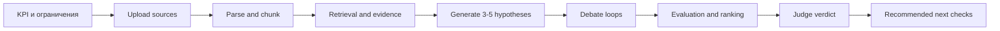
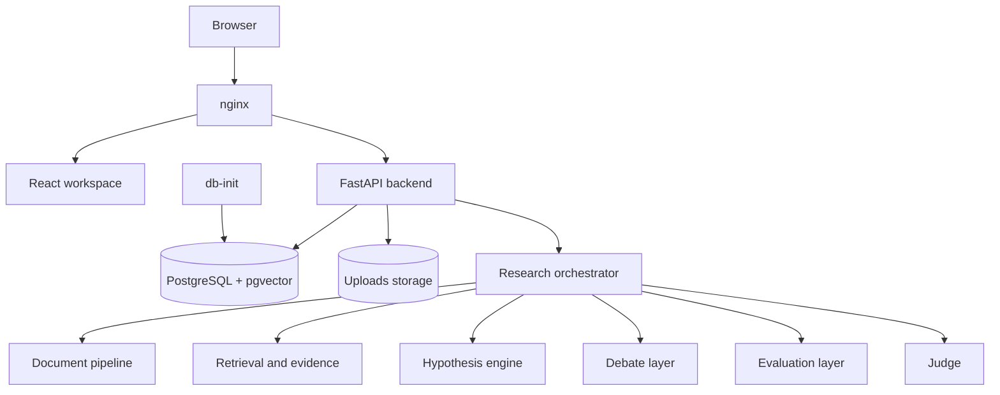

# Hypothesis Court

<p align="center">
  <strong>Explainable R&amp;D workspace</strong> for turning KPI, constraints, and source materials into ranked hypotheses, internal debate, and a final recommendation.
</p>

<p align="center">
  
  
  
  
</p>

<p align="center">
  
</p>

<p align="center">
  Session-based research pipeline • Evidence-first reasoning • Debate loop • Knowledge graph • Verdict and ranking
</p>

<p align="center">
  <a href="#что-это">Что это</a> •
  <a href="#галерея">Галерея</a> •
  <a href="#как-работает-продукт">Flow</a> •
  <a href="#архитектура">Архитектура</a> •
  <a href="#быстрый-запуск">Запуск</a> •
  <a href="#как-проект-развивался">История</a>
</p>

<table>
  <tr>
    <td align="center"><strong>3-5</strong><br>стартовых гипотез</td>
    <td align="center"><strong>5</strong><br>слоев исследовательского контура</td>
    <td align="center"><strong>10+</strong><br>поддерживаемых форматов источников</td>
    <td align="center"><strong>1</strong><br>workspace для evidence, debate и verdict</td>
  </tr>
</table>

## Что это

**Hypothesis Court** не пытается быть обычным чатом с LLM. Это исследовательская рабочая среда, в которой:

- пользователь формулирует `KPI`, ограничения и контекст;
- загружает документы, таблицы, PDF и изображения;
- получает `evidence pack`, а не просто текстовый ответ;
- видит стартовый набор из `3-5` гипотез;
- наблюдает `debate loop` по каждой гипотезе;
- получает независимую оценку, ranking и verdict judge;
- может открыть knowledge graph и пройти весь путь от исходников до рекомендации.

Результат одной исследовательской сессии:

- `research brief`
- `source bundle`
- `evidence pack`
- `initial hypothesis set`
- `hypothesis versions`
- `debate transcript`
- `evaluation sheet`
- `ranking sheet`
- `final recommendation`

## Чем проект силен

<table>
  <tr>
    <td width="33%"><strong>Evidence-first workflow</strong><br>Гипотезы не висят в воздухе, а опираются на конкретные фрагменты документов.</td>
    <td width="33%"><strong>Agent debate</strong><br>Каждая гипотеза проходит Defender, Attacker и Manufacturer вместо одного прямого ответа.</td>
    <td width="33%"><strong>Explainability by design</strong><br>Пользователь видит не только verdict, но и весь маршрут от brief до ranking.</td>
  </tr>
  <tr>
    <td width="33%"><strong>Knowledge graph</strong><br>Связывает вводные, файлы, evidence, гипотезы, оценки и следующий шаг.</td>
    <td width="33%"><strong>Versioned research runs</strong><br>Позволяет хранить и переключать версии исследования внутри одной сессии.</td>
    <td width="33%"><strong>Admin and provider control</strong><br>Настраивает пользователей, текстовый провайдер и embedding-провайдер без правки кода.</td>
  </tr>
</table>

## Галерея

<table>
  <tr>
    <td colspan="2">
      
    </td>
  </tr>
  <tr>
    <td align="center">Общий вид workspace: hypothesis cards, scene, verdict, ranking и processed attachments</td>
    <td align="center">Реальный demo-run по кейсу хвостов КГМК</td>
  </tr>
  <tr>
    <td>
      
    </td>
    <td>
      
    </td>
  </tr>
  <tr>
    <td align="center">Hover-preview гипотезы с кратким механизмом, KPI alignment и feasibility</td>
    <td align="center">Knowledge graph: вводные, источники, evidence, гипотезы и verdict в одной карте</td>
  </tr>
  <tr>
    <td colspan="2">
      
    </td>
  </tr>
  <tr>
    <td colspan="2" align="center">Вход в исследовательскую рабочую среду</td>
  </tr>
</table>

## Как работает продукт



### Screen Tour

1. Формулирует задачу через `KPI`, ограничения и контекст.
2. Загружает документы и вспомогательные материалы.
3. Дожидается обработки и индексации файлов.
4. Получает evidence с привязкой к исходникам.
5. Смотрит стартовый набор гипотез.
6. Наблюдает внутреннюю критику и доработку гипотез.
7. Изучает evaluator outputs и рейтинг.
8. Получает финальную рекомендацию и список первых проверок.

## Что можно загружать

Поддерживаемые текстовые и табличные форматы:

- `txt`
- `md`, `markdown`, `log`
- `csv`
- `json`
- `xml`
- `html`, `htm`
- `pdf`
- `docx`
- `xlsx`

Поддерживаемые изображения:

- `bmp`
- `jpeg`, `jpg`
- `png`
- `tif`, `tiff`
- `webp`

Для изображений проект умеет:

- использовать vision description, если выбранный провайдер поддерживает картинки;
- падать обратно в `Tesseract OCR (rus+eng)`, если vision-модель недоступна.

## Архитектура



Runtime включает:

- `frontend`
- `backend`
- `postgres`
- `db-init`
- `nginx`

Архитектурный принцип:

- `frontend` отвечает за research workspace, scene и graph UX;
- `backend` держит API, orchestration, state и export logic;
- `research orchestrator` явно проводит ingestion, retrieval, hypothesis generation, debate, evaluation и judge;
- `postgres + pgvector` хранят identity, session state, chunks, evidence и версии research runs.

## Быстрый запуск

Нужны:

- `git`
- `docker`
- `docker compose`

```bash
git clone https://github.com/KroJIak/hypothesis-court.git
cd hypothesis-court
cp .env.example .env
docker compose up --build
```

После старта:

- приложение: `http://localhost:8080`
- backend docs: `http://localhost:8080/api/docs`

Если вы изменили `NGINX_EXTERNAL_PORT`, открывайте свой порт из `.env`.

Самый короткий путь локально:

1. Заполнить `.env`.
2. Поднять `docker compose up --build`.
3. Войти под `SUPERADMIN_USERNAME` / `SUPERADMIN_PASSWORD`.
4. Загрузить материалы и запустить research session.

## Минимальная конфигурация `.env`

Заполняйте `.env` на основе `.env.example`. Минимально важные переменные:

```env
POSTGRES_DB=...
POSTGRES_USER=...
POSTGRES_PASSWORD=...

AUTH_JWT_SECRET=...

SUPERADMIN_USERNAME=superadmin
SUPERADMIN_PASSWORD=...

MODEL_PROVIDER_BASE_URL=...
MODEL_PROVIDER_API_KEY=...
MODEL_PROVIDER_MODEL=...
MODEL_PROVIDER_API_MODE=chat_completions
MODEL_PROVIDER_FOLDER_ID=

EMBEDDING_BASE_URL=...
EMBEDDING_API_KEY=...
EMBEDDING_MODEL=...
EMBEDDING_FOLDER_ID=
```

Важно:

- `MODEL_PROVIDER_*` нужны для hypothesis generation, debate, evaluation и judge verdict.
- `EMBEDDING_*` нужны для document retrieval и evidence layer.
- для OpenAI-compatible провайдеров `*_FOLDER_ID` обычно можно оставить пустым.
- настройки провайдеров можно поправить и после входа через admin panel.

## Демо-кейс из скриншотов

Скриншоты в README сняты с локального запуска проекта в разрешении `1920x1080` на кейсе из [docs/internal/Tailings-Example](./docs/internal/Tailings-Example/00-INDEX.md).

Использованный пакет источников:

- `KGMK-Hypotheses.docx`
- `KGMK-Tailings.xlsx`
- `How-To-Read-Institute-Tailings-Report.docx`
- `Flotation-Schemes.pdf`

Исследовательская постановка:

- снизить потери элементов `28` и `29` в хвостах КГМК минимум на `10%`;
- не ломать основной перерабатывающий контур;
- выбирать гипотезу, которую реально можно пилотировать на действующем оборудовании.

## Как проект развивался

По истории репозитория и внутренней документации проект развивался не как landing page, а как реальный продуктовый контур:

1. Сначала появился базовый React workspace и позиционирование как `chat-based R&D assistant`.
2. Затем были добавлены auth, admin-panel, суперпользователь, provider settings и runtime на `Docker Compose`.
3. После этого проект вырос в session-based workspace: persistent chats, файлы, пользовательские агенты, verdict UI и account surface.
4. Следующий крупный шаг: полноценный `research pipeline` с background runs, progress tracking, versioned runs, evaluation stage и judge.
5. Последние крупные изменения усилили explainability: knowledge graph, input-to-evidence links, image support, OCR fallback и draft inputs для research sessions.

Итог: репозиторий уже содержит не прототип экрана, а законченную explainable R&D platform с product docs, architecture docs и рабочим локальным runtime.

Что особенно видно по истории:

- сначала проект был ближе к research chat;
- затем превратился в session-based workspace;
- потом получил полноценный orchestrated pipeline;
- на последних итерациях усилил explainability через graph, versioned runs, OCR и richer evidence mapping.

## Структура репозитория

```text
backend/   FastAPI API, orchestration, models, services, Alembic
frontend/  React workspace, auth, scene, graph, UI logic
nginx/     reverse proxy and external entrypoint
docs/      product, architecture, internal examples, source materials
```

## Карта документации

- [docs/01-Project-Scope.md](./docs/01-Project-Scope.md)
- [docs/02-Product-Model.md](./docs/02-Product-Model.md)
- [docs/product/03-Hypothesis-Pipeline.md](./docs/product/03-Hypothesis-Pipeline.md)
- [docs/product/06-Session-Walkthrough.md](./docs/product/06-Session-Walkthrough.md)
- [docs/architecture/01-System-Overview.md](./docs/architecture/01-System-Overview.md)
- [docs/architecture/02-System-Architecture.md](./docs/architecture/02-System-Architecture.md)
- [docs/architecture/06-Infrastructure.md](./docs/architecture/06-Infrastructure.md)

## Полезные команды

```bash
docker compose up --build
docker compose up --build -d
docker compose down
docker compose logs -f
docker compose down -v
```

`docker compose down -v` удаляет PostgreSQL data и загруженные файлы.

## Частые проблемы

### Не открывается приложение

- проверьте `docker compose ps`
- проверьте, какой `NGINX_EXTERNAL_PORT` стоит в `.env`

### Research pipeline не стартует

- проверьте `MODEL_PROVIDER_BASE_URL`
- проверьте `MODEL_PROVIDER_API_KEY`
- проверьте `MODEL_PROVIDER_MODEL`

### Файлы загружаются, но evidence не строится

- проверьте `EMBEDDING_BASE_URL`
- проверьте `EMBEDDING_API_KEY`
- проверьте `EMBEDDING_MODEL`

### После изменения `.env` ничего не меняется

```bash
docker compose down
docker compose up --build
```

## Support

Если сервис не поднимается или ошибка непонятна, напишите в Telegram: `@krojiak`.
