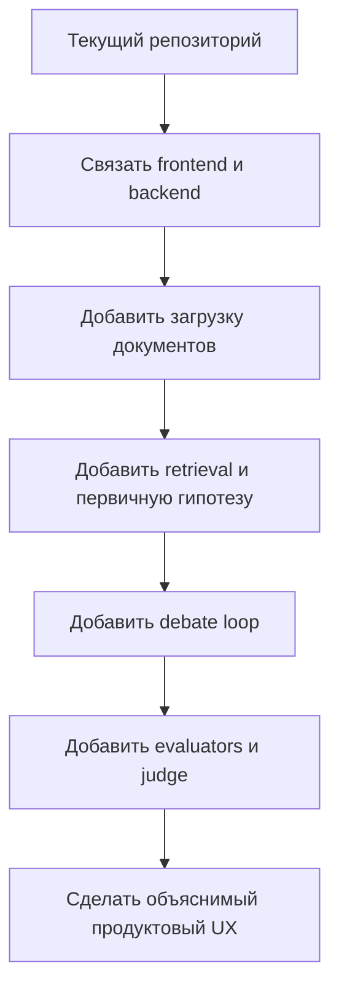

---
tags:
  - docs
  - mvp
  - target
---

# Минимальный и целевой продукт

> [!important]
> Этот файл нужен, чтобы команда не путала **текущий каркас репозитория** с **тем продуктом, который мы реально хотим построить**.

## Коротко

- **Сейчас в репозитории** есть базовый backend c `/health`, UI-прототип рабочего пространства и nginx-прокси.
- **Ближайший MVP** должен связать UI, загрузку документов, простой retrieval и один полный прогон гипотезы через debate + evaluation.
- **Целевой продукт** должен стать объяснимым R&D-ассистентом с несколькими типами источников, полноценным evidence layer, версионированием гипотез и наглядной сценой агентного обсуждения.

## Сравнение по слоям

| Слой | Что есть сейчас | Что должно быть в MVP | Что должно быть в целевом продукте |
| --- | --- | --- | --- |
| Backend | FastAPI, `/health`, CORS | API загрузки документов, постановки задачи, запуска анализа, чтения результатов | Полный оркестратор пайплайна, хранение артефактов, версии гипотез, статусы сессий |
| Frontend | Визуальный mock workspace на моках | Рабочий интерфейс с реальным API, сценой агентов и карточками результатов | Полноценная интерактивная визуальная новелла с историей итераций и evidence view |
| AI pipeline | Нет | Простой RAG по чанкам + базовая генерация гипотез + 1 debate cycle | Многошаговый pipeline: retrieval, contradiction mining, debate loop, independent evaluation, judge synthesis |
| Данные | Нет БД | Базовая БД для сессий, документов и результатов | PostgreSQL + pgvector, артефакты доказательств, структура claims/facts, история ревизий |
| Infra | Docker Compose, nginx, env | Локальный dev-цикл и стабильный proxy `/api` | Развёртывание окружений, фоновая обработка, наблюдаемость |

## Каноническая развилка

## Что нельзя перепутать

> [!warning]
> Наличие красивой сцены агентов во frontend **не означает**, что пайплайн уже работает.

> [!warning]
> Наличие CORS, docker-compose и nginx **не означает**, что backend уже умеет анализировать документы.

## Источник решений

- [[sources/02-Chat-Decisions]] фиксирует, какие продуктовые решения уже были проговорены.
- [[architecture/01-Current-State]] фиксирует, что реально есть в коде.

## Связанные документы

- [[03-Roadmap]]
- [[architecture/01-Current-State]]
- [[architecture/02-Target-System]]
