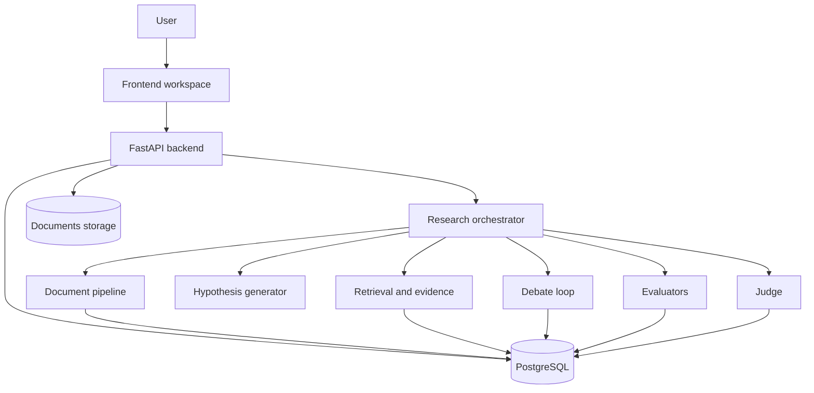

---
tags:
  - docs
  - architecture
  - target
---

# Целевая система

## Домены системы

- `frontend`
- `backend api`
- `orchestrator`
- `document pipeline`
- `retrieval / evidence layer`
- `evaluation layer`
- `database`
- `object storage` или файловое хранилище документов

## Целевая схема

## Архитектурный принцип

> [!important]
> Основная логика должна жить не в “магическом агентном фреймворке”, а в явном Python-оркестраторе с понятными шагами, схемами входа и выхода и контролируемым состоянием.

## Основные модули

### Document pipeline

Отвечает за:

- загрузку;
- извлечение текста;
- разбиение;
- метаданные;
- подготовку к поиску.

### Retrieval / evidence layer

Отвечает за:

- поиск по материалам;
- сбор релевантных фрагментов;
- поиск противоречий;
- выделение полезных claims/facts;
- подготовку evidence pack.

### Hypothesis generator

Отвечает за:

- создание первичных гипотез;
- привязку к KPI и ограничениям;
- первичную структуризацию аргументов.

### Debate loop

Отвечает за:

- управляемый цикл ролей;
- выпуск новых версий гипотезы;
- логирование аргументов и возражений.

### Evaluation layer

Отвечает за:

- независимые метрики;
- дополнительные критерии;
- единый формат оценок.

### Judge

Отвечает за:

- сбор результатов;
- приоритизацию;
- финальную рекомендацию.

## Технический стиль реализации

- Python + FastAPI
- SQLAlchemy + Alembic
- PostgreSQL
- pgvector как предпочтительное направление для retrieval-слоя
- Docker Compose для локальной разработки
- nginx как entrypoint для браузерного доступа
- React frontend

## Связанные документы

- [[03-Backend]]
- [[04-Frontend]]
- [[05-Data-and-Retrieval]]
- [[06-Infrastructure]]
