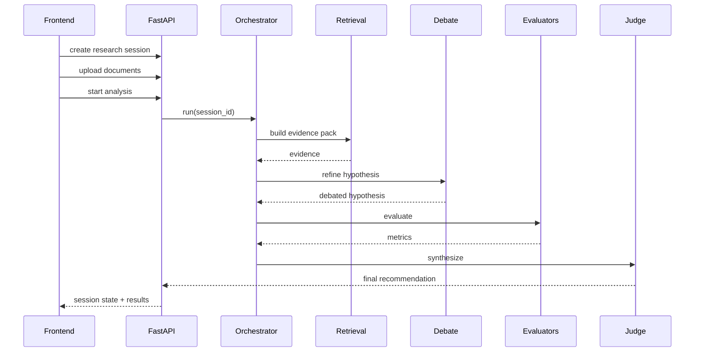

---
tags:
  - docs
  - architecture
  - backend
---

# Бэкенд

## Роль backend

Backend должен быть не просто “тонким API”, а управляемой точкой входа в исследовательский pipeline:

- принимать команды пользователя;
- хранить сессии и документы;
- запускать и координировать шаги анализа;
- сохранять артефакты;
- отдавать frontend наблюдаемое состояние процесса.

## Что есть сейчас

- FastAPI app с маршрутом `/health`
- env-настройка CORS
- минимальная структура `api / schemas / services / core`

## Что должно быть дальше

### Базовые сущности

- `research_session`
- `source_document`
- `document_chunk`
- `evidence_item`
- `hypothesis`
- `debate_round`
- `evaluation_result`
- `final_recommendation`

### Базовые endpoint-группы

- `health`
- `research sessions`
- `documents`
- `analysis runs`
- `hypotheses`
- `debates`
- `evaluations`
- `recommendations`

## Предпочтительная внутренняя структура

```text
backend/app/
├── api/
│   ├── deps/
│   └── routes/
├── core/
├── db/
├── models/
├── repositories/
├── schemas/
├── services/
├── orchestrators/
└── workers/
```

## Принцип разделения ответственности

> [!check]
> Для этого проекта важно сохранить управляемость и тестируемость.

- `routes` принимают и валидируют HTTP.
- `services` содержат прикладную бизнес-логику.
- `repositories` работают с БД.
- `orchestrators` управляют многошаговым pipeline.
- `schemas` определяют внешние и внутренние контракты данных.

## Канонический сценарий backend-пайплайна



## Что важно не делать

- Не прятать всё в одном giant service.
- Не привязывать доменную логику к HTTP-слою.
- Не делать неструктурированные LLM-ответы основным контрактом между слоями.
- Не превращать debate loop в бесконтрольный агентный sandbox.

## Связанные документы

- [[02-Target-System]]
- [[05-Data-and-Retrieval]]
- [[product/03-Hypothesis-Pipeline]]
