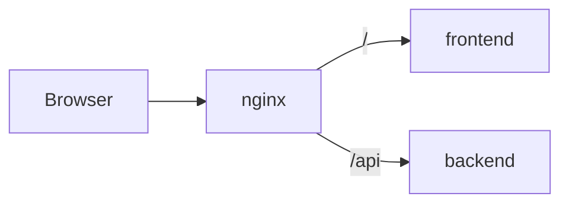

---
tags:
  - docs
  - architecture
  - infra
---

# Инфраструктура

## Текущая локальная схема

- `backend` работает внутри контейнера на `8000`
- `frontend` работает внутри контейнера на `5173`
- `nginx` работает внутри контейнера на `80`

Внешние порты задаются через `docker-compose.override.yml` и `.env`.

## Текущий proxy-контур

## Что уже настроено

- отдельные Dockerfile для `backend`, `frontend`, `nginx`;
- compose-файл для общего контура;
- override-файл для проброса портов;
- env-переменные для CORS и allowed hosts;
- proxy `/api` через nginx.

## Что должно остаться правилом

- Для браузерного сценария основной вход должен быть через `nginx`.
- Для локальной разработки frontend вне docker должен уметь ходить напрямую в backend через свой env-файл.
- Порты и домены не должны хардкодиться в приложениях.

## Важные env-переменные

### Корневой `.env`

- `NGINX_EXTERNAL_PORT`
- `BACKEND_EXTERNAL_PORT`
- `BACKEND_CORS_ALLOW_ORIGINS`
- `FRONTEND_ALLOWED_HOSTS`

### Frontend local env

- `VITE_API_BASE_URL`

## Следующий шаг по infra

- добавить persistent storage для backend-данных;
- добавить БД в compose;
- предусмотреть init/migration workflow;
- продумать фоновые задачи, если пайплайн станет долгим.

## Связанные документы

- [[01-Current-State]]
- [[03-Backend]]
- [[04-Frontend]]
