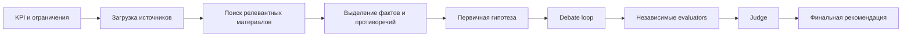

---
tags:
  - docs
  - product
  - user-flow
---

# Сценарий пользователя

## Канонический сценарий

1. Пользователь задаёт цель исследования.
2. Пользователь указывает KPI, ограничения и контекст.
3. Пользователь загружает источники: статьи, отчёты, эксперименты, внутренние материалы.
4. Система находит релевантные данные и формирует evidence base.
5. Система предлагает первичные гипотезы.
6. Одна гипотеза проходит debate loop.
7. Готовая версия гипотезы передаётся в независимую оценку.
8. Судья собирает итоговую рекомендацию.
9. Пользователь изучает сильные и слабые стороны и решает, что проверять первым.

## Flow

## Что пользователь должен видеть на каждом шаге

| Шаг | Что видит пользователь | Зачем это нужно |
| --- | --- | --- |
| Постановка задачи | KPI, ограничения, описание контекста | Чтобы гипотеза не оторвалась от реальной цели |
| Retrieval | Какие документы и фрагменты были подняты | Чтобы доверять доказательной базе |
| Первичная гипотеза | Краткую формулировку и базовое обоснование | Чтобы понять, о чём спорят агенты |
| Debate | Реплики ролей и правки версии гипотезы | Чтобы увидеть внутреннюю критику |
| Evaluation | Независимые оценки по критериям | Чтобы не смешивать аргументы разных типов |
| Verdict | Приоритет, риски, ценность и next steps | Чтобы принять практическое решение |

## Базовые пользовательские сущности

- **Research session** — одна исследовательская сессия по конкретной задаче.
- **Source document** — отдельный загруженный источник.
- **Evidence item** — фрагмент знания, который реально участвует в аргументации.
- **Hypothesis** — версия гипотезы в конкретный момент времени.
- **Debate round** — один раунд спора ролей.
- **Evaluation result** — результат отдельного оценочного агента.
- **Final recommendation** — синтез судьи.

## Что важно для UX

> [!tip]
> Пользователь должен видеть не только финал, но и **траекторию созревания гипотезы**.

- Какие источники были использованы.
- Где были противоречия.
- Что именно исправил спор.
- Почему итоговый вариант лучше первой версии.

## Связанные документы

- [[03-Hypothesis-Pipeline]]
- [[04-Agents-and-Judge]]
- [[05-Interface-and-Scene]]
