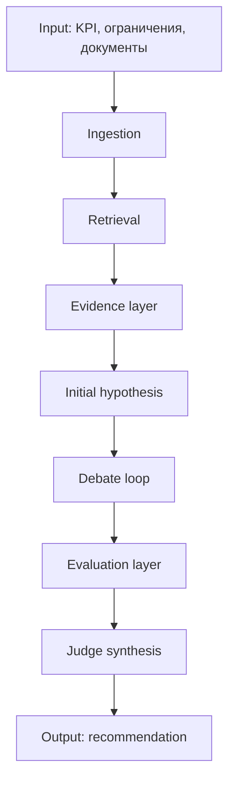

---
tags:
  - docs
  - product
  - pipeline
---

# Пайплайн гипотез

> [!abstract]
> Ниже зафиксирован целевой функциональный pipeline. Это не описание текущей реализации, а каноническая логика продукта.

## Верхнеуровневая схема

## Этап 1. Ingestion

Система принимает:

- научные статьи;
- внутренние отчёты;
- результаты прошлых экспериментов;
- служебные заметки и дополнительные материалы;
- KPI и ограничения пользователя.

Результат этапа:

- документы приведены к машиночитаемому виду;
- текст разбит на единицы анализа;
- метаданные источников сохранены.

## Этап 2. Retrieval

Система должна находить:

- релевантные факты;
- похожие подходы;
- исторические удачи;
- исторические провалы;
- противоречия между источниками;
- пробелы, где данных недостаточно.

Результат этапа:

- набор evidence items для текущей исследовательской задачи.

## Этап 3. Initial hypothesis

На основе evidence система формирует несколько первичных гипотез, каждая из которых:

- относится к заданному KPI;
- проверяема;
- имеет аргументацию;
- имеет ограничения;
- не притворяется доказанным фактом.

## Этап 4. Debate loop

Одна выбранная гипотеза проходит цикл:

1. `Защищающий` усиливает её.
2. `Атакующий` ищет слабые места.
3. `Производственник` проверяет практическую реализуемость.
4. Если нужно, гипотеза пересобирается.
5. Цикл повторяется, но не более трёх раундов.

Результат этапа:

- улучшенная версия гипотезы;
- история правок;
- карта аргументов за и против.

## Этап 5. Evaluation layer

После завершения спора гипотеза оценивается независимо:

- `Finance` считает стоимость и экономическую целесообразность;
- `Risk` оценивает неопределённость и вероятность неудачи;
- дополнительные evaluators могут учитывать экологичность, безопасность, масштабируемость, патентную чистоту, импортозамещение и другие критерии.

> [!important]
> Evaluators не спорят между собой. Они считают метрики независимо и передают их судье.

## Этап 6. Judge synthesis

Судья должен:

- собрать аргументы debate loop;
- собрать оценки evaluators;
- выдать приоритет гипотезы;
- показать сильные и слабые стороны;
- обозначить уровень риска;
- назвать потенциальную ценность;
- подсказать, что проверять первым.

> [!warning]
> Судья не должен внезапно придумывать совершенно новую гипотезу, не связанную с тем, что обсуждали остальные роли.

## Ожидаемые артефакты на выходе

- `research brief`
- `evidence pack`
- `hypothesis v1`
- `hypothesis v2..vN`
- `debate transcript`
- `evaluation sheet`
- `final recommendation`

## Связанные документы

- [[04-Agents-and-Judge]]
- [[architecture/05-Data-and-Retrieval]]
- [[architecture/03-Backend]]
