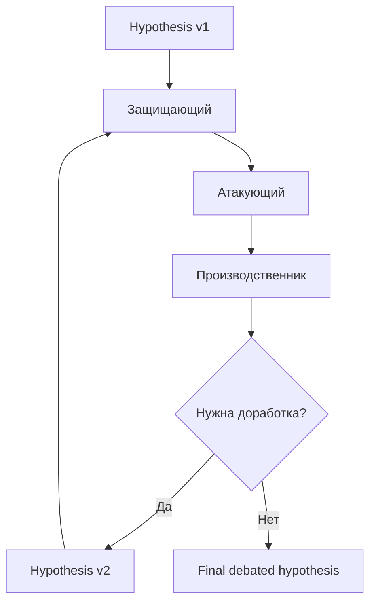

---
tags:
  - docs
  - product
  - agents
---

# Агенты и судья

> [!important]
> Внутри debate loop все роли обсуждают **одну и ту же гипотезу**, а не генерируют каждая свою.

## Канонический состав ролей

### Debate loop

- `Защищающий`
- `Атакующий`
- `Производственник`

### Evaluation layer

- `Finance`
- `Risk`
- пользовательские evaluators по дополнительным критериям

### Final synthesis

- `Judge`

## Роли в debate loop

### Защищающий

Задача роли:

- найти сильные аргументы в пользу гипотезы;
- усилить формулировку;
- связать её с evidence;
- показать, почему гипотеза стоит дальнейшей проверки.

### Атакующий

Задача роли:

- найти логические и доказательные слабости;
- указать на противоречия;
- показать, где данных мало;
- отделить правдоподобность от реальной обоснованности.

### Производственник

Задача роли:

- проверить, можно ли реализовать идею в реальных условиях;
- заставить гипотезу учитывать ограничения производства;
- отсеять решения, которые красивы в теории, но неработоспособны на практике.

> [!note]
> Производственник участвует **внутри основного цикла**, а не как внешний постфактум-комментатор.

## Логика цикла

## Ограничения цикла

- Максимум три раунда.
- Каждая новая версия гипотезы должна отличаться от предыдущей не косметически, а по смыслу.
- Каждый раунд должен быть привязан к evidence, а не к чистой риторике.

## Evaluation layer

Evaluators работают по другой логике:

- они не спорят друг с другом;
- они не переписывают гипотезу;
- они оценивают уже готовую debated version;
- они возвращают структурированные метрики и замечания.

## Judge

Судья:

- агрегирует выводы debate layer;
- агрегирует выводы evaluation layer;
- принимает решение о приоритете гипотезы;
- описывает, что стоит делать дальше.

Итог судьи должен содержать:

- краткий вердикт;
- приоритет;
- сильные стороны;
- слабые стороны;
- ключевые риски;
- ожидаемую ценность;
- рекомендованный первый эксперимент или первый шаг проверки.

## Что уже решено

> [!check]
> Эти решения уже закрепились в истории обсуждения и считаются каноническими:

- custom agents не должны жить внутри debate loop;
- они должны жить в evaluation layer;
- спор нужен для улучшения гипотезы, а не для театра ради театра;
- основная “фишка” продукта — именно дебаты и их объяснимость.

## Связанные документы

- [[03-Hypothesis-Pipeline]]
- [[05-Interface-and-Scene]]
- [[sources/02-Chat-Decisions]]
