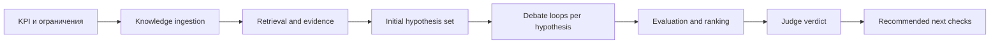
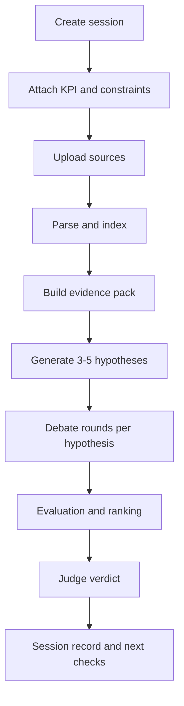

---
tags:
  - docs
  - product
  - operating-model
---

# Product Model

> [!abstract]
> Hypothesis Court работает как единая R&D-платформа, в которой постановка задачи, работа с материалами, агентный спор и финальная оценка соединены в один управляемый исследовательский контур.

## Операционная модель

## Основные продуктовые слои

| Слой | Роль | Основной результат |
| --- | --- | --- |
| Research input | Формулирует задачу и ограничения | Research brief |
| Knowledge layer | Собирает и структурирует материалы | Searchable evidence base |
| Hypothesis engine | Формирует стартовый набор гипотез | Initial hypothesis set |
| Debate layer | Усиливает и критикует каждую гипотезу по очереди | Refined hypothesis set |
| Evaluation layer | Считает независимые критерии и сравнивает варианты | Evaluation and ranking sheet |
| Judge layer | Приоритизирует и формулирует решение | Final recommendation |
| Workspace UI | Показывает весь путь пользователю | Explainable research session |

## Канонический output

Каждая гипотеза в системе включает:

- формулировку;
- связь с KPI;
- ожидаемый механизм влияния;
- supporting evidence;
- contradictory evidence;
- производственные ограничения;
- риск-профиль;
- экономическую оценку;
- рекомендованный первый шаг проверки.

## Исследовательская сессия как единица работы

Система организует работу вокруг `research session`.
Внутри одной сессии живут:

- user brief;
- source documents;
- evidence items;
- initial hypothesis set;
- hypothesis versions per candidate;
- debate rounds per candidate;
- evaluator outputs;
- final verdict.

## Пользовательский режим работы

Пользователь работает не с абстрактным prompt, а с управляемой сессией:

1. задаёт исследовательскую цель;
2. прикладывает материалы;
3. отслеживает сбор evidence;
4. получает стартовый набор гипотез;
5. наблюдает debate по активной гипотезе;
6. читает независимые оценки и сравнение вариантов;
7. получает verdict и список первичных проверок.

## Research lifecycle

Полный цикл одной исследовательской сессии выглядит так:

1. Пользователь создаёт research session.
2. Система принимает KPI, ограничения и описание контекста.
3. Пользователь загружает материалы.
4. Document pipeline извлекает и нормализует содержание.
5. Retrieval engine поднимает релевантные сигналы и contradictions.
6. Hypothesis engine выпускает стартовый набор из `3-5` гипотез.
7. Debate layer проводит цикл `Defender -> Attacker -> Manufacturer` по каждой гипотезе отдельно.
8. Цикл останавливается по stop condition или по round limit из pipeline settings.
9. Evaluation layer считает независимые критерии по refined hypothesis set.
10. Judge synthesizes final verdict и ранжирование.
11. Workspace фиксирует результат, evidence и next checks.

## Session stages

| Стадия | Что делает система | Что получает пользователь |
| --- | --- | --- |
| Intake | Регистрирует задачу и контекст | Чётко оформленный research brief |
| Ingestion | Разбирает и индексирует материалы | Подготовленную knowledge base |
| Evidence | Находит support, risk и contradictions | Видимый набор оснований |
| Hypothesis | Формирует стартовый набор вариантов | Список из `3-5` гипотез |
| Debate | Проводит внутреннюю критику по каждой гипотезе | Уточнённые версии и историю изменений |
| Evaluation | Считает независимые критерии и сравнение | Набор метрик, ranking и замечаний |
| Verdict | Приоритизирует и фиксирует первичную проверку | Финальную рекомендацию |

## Session artifacts

- `research_brief`
- `source_bundle`
- `evidence_pack`
- `initial_hypothesis_set`
- `hypothesis_versions`
- `debate_transcript`
- `evaluation_sheet`
- `ranking_sheet`
- `final_recommendation`

## Связанные документы

- [[product/02-User-Flow]]
- [[architecture/02-System-Architecture]]
