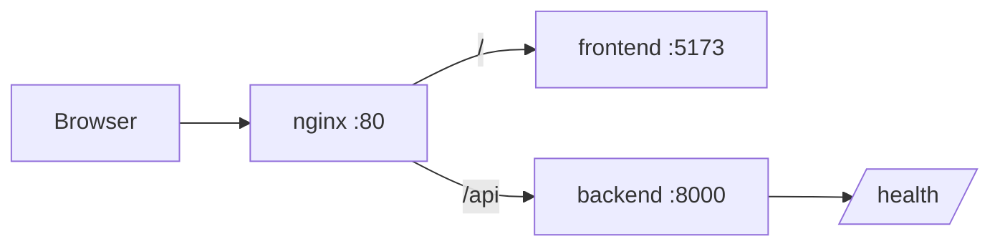

---
tags:
  - docs
  - architecture
  - current-state
---

# Текущее состояние

> [!important]
> Этот файл описывает только то, что уже реально есть в репозитории на текущий момент.

## Что собрано сейчас

### Backend

- FastAPI-приложение с фабрикой `create_app`.
- Подключён CORS через env.
- Есть единственный маршрут `/health`.
- Есть минимальные `schemas` и `services` для health-check ответа.

Ключевые файлы:

- `backend/app/main.py`
- `backend/app/core/settings.py`
- `backend/app/api/routes/health.py`
- `backend/app/services/health_service.py`

### Frontend

- React + Vite.
- `App.jsx` рендерит workspace-сцену.
- Есть UI-прототип “рабочего места” с несколькими панелями.
- Данные пока приходят из mock layer, а не из реального backend pipeline.

Ключевые файлы:

- `frontend/src/App.jsx`
- `frontend/src/features/workspace/components/WorkspacePage.jsx`
- `frontend/src/features/workspace/hooks/useWorkspaceScene.js`
- `frontend/src/features/workspace/data/mockWorkspaceScene.js`

### Infra

- Есть `docker-compose.yml`.
- Есть `docker-compose.override.yml`.
- Есть `nginx`, который проксирует `/api` в backend, а `/` во frontend.
- В override вынесены внешние порты.

Ключевые файлы:

- `docker-compose.yml`
- `docker-compose.override.yml`
- `nginx/conf.d/default.conf`

## Фактическая схема текущего запуска



## Что важно понимать про текущий frontend

Текущий frontend уже показывает продуктовую идею:

- сцена debate loop;
- stage evaluators;
- judge;
- чат-сессии;
- вложения;
- composer.

Но сейчас это всё ещё:

- mock data;
- без ingestion;
- без retrieval;
- без debate orchestration;
- без judge pipeline;
- без постоянного хранения результатов.

## Что отсутствует

- база данных;
- alembic migrations;
- модели предметной области;
- API загрузки документов;
- API запуска research session;
- retrieval layer;
- LLM orchestration;
- versioning of hypotheses;
- хранение evidence;
- реальная интеграция frontend <-> product pipeline.

## Структура верхнего уровня

```text
backend/   - API-каркас
frontend/  - UI-прототип рабочего пространства
nginx/     - reverse proxy
docs/      - документация
testing/   - локальные исходные материалы для анализа
```

## Связанные документы

- [[02-Target-System]]
- [[03-Backend]]
- [[04-Frontend]]
- [[06-Infrastructure]]
