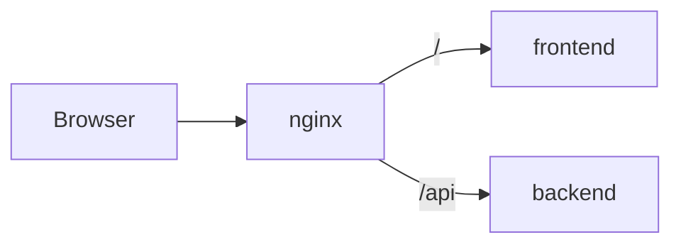

---
tags:
  - docs
  - architecture
  - overview
---

# System Overview

## Платформенный состав

Hypothesis Court состоит из трёх основных продуктовых доменов:

- `backend` — API, orchestration, session state and domain services;
- `frontend` — research workspace и сцена взаимодействия;
- `nginx` — entrypoint и прокси для браузерного доступа.

Дополняющие домены:

- `docs` — product and architecture documentation;
- `sources` внутри `docs` — архив исходных материалов и decision log.

## Репозиторий

```text
backend/   - API, domain services, orchestration entrypoints
frontend/  - workspace UI, scene components, client-side session flow
nginx/     - reverse proxy and external entrypoint
docs/      - operational product and architecture documentation
```

## Runtime topology



## Доменные обязанности

### Backend

- хранит и обслуживает исследовательские сессии;
- управляет пайплайном гипотез;
- агрегирует evidence и verdict.

### Frontend

- показывает debate scene;
- отображает evidence, evaluators и verdict;
- организует пользовательский путь внутри research session.

### nginx

- публикует единый вход для браузера;
- разделяет frontend и API traffic;
- поддерживает стабильный маршрут `/api`.

## Главные системные свойства

- explainability by design;
- explicit orchestration;
- source-backed reasoning;
- session-based workflow;
- containerized runtime.

## Связанные документы

- [[02-System-Architecture]]
- [[03-Backend]]
- [[04-Frontend]]
- [[06-Infrastructure]]
