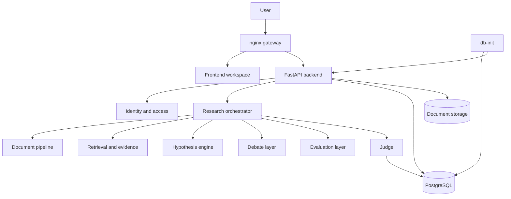
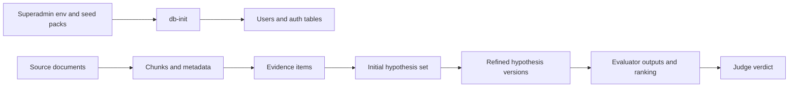

---
tags:
  - docs
  - architecture
  - system
---

# System Architecture

## Домены системы

- `nginx gateway`
- `identity and access`
- `frontend workspace`
- `backend api`
- `db-init`
- `research orchestrator`
- `document pipeline`
- `retrieval and evidence layer`
- `debate layer`
- `evaluation layer`
- `judge layer`
- `database`
- `document storage`

## Архитектурная схема

## Архитектурный принцип

Основная логика живёт в явном Python-оркестраторе. Агентные роли выполняются как управляемые шаги пайплайна с заданными prompt- и schema-контрактами. Количество стартовых гипотез и round limit debate loop задаются через pipeline settings, а не через разрозненные prompt-хаки.

## Системные модули

### Identity and access

- login по `username` и `password`;
- access и refresh tokens;
- управление пользователями без публичной регистрации;
- bootstrap суперпользователя из `.env`;
- отзыв сессий и контроль `token_version`.

### Document pipeline

- ingestion;
- text extraction;
- chunking;
- metadata normalization.

### Retrieval and evidence

- semantic search;
- contradiction detection;
- claims and signals extraction;
- evidence pack assembly.

### Hypothesis engine

- generation of `3-5` initial hypotheses;
- mechanism framing;
- KPI alignment.

### Debate layer

- role sequencing per active hypothesis;
- round-limit enforcement;
- version release;
- transcript and argument map.

### Evaluation layer

- independent criteria scoring per refined hypothesis;
- ranking sheet assembly;
- structured evaluator outputs.

### Judge

- final synthesis across refined hypothesis set;
- prioritization;
- recommendation artifact.

## Контур данных

## Связанные документы

- [[01-System-Overview]]
- [[03-Backend]]
- [[backend/02-Authentication-and-Tokens]]
- [[database/01-Identity-and-Auth-Schema]]
- [[05-Data-and-Retrieval]]
