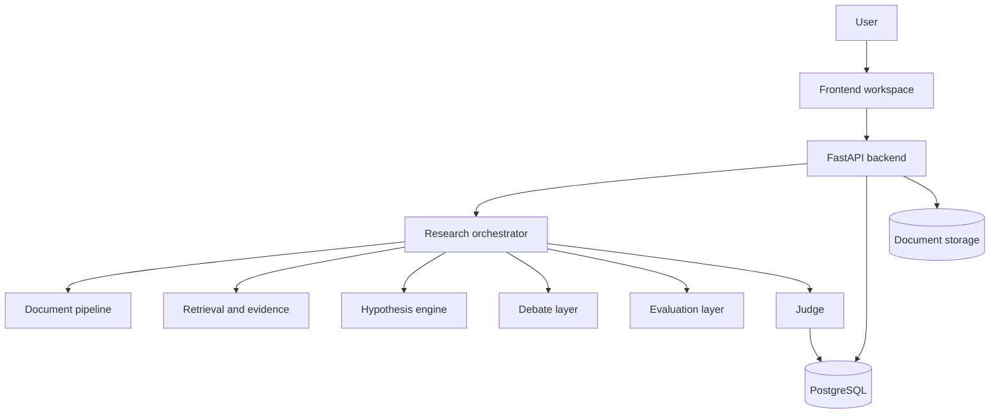

---
tags:
  - docs
  - architecture
  - system
---

# System Architecture

## Домены системы

- `frontend workspace`
- `backend api`
- `research orchestrator`
- `document pipeline`
- `retrieval and evidence layer`
- `debate layer`
- `evaluation layer`
- `judge layer`
- `database`
- `document storage`

## Архитектурная схема

## Архитектурный принцип

Основная логика живёт в явном Python-оркестраторе. Агентные роли выполняются как управляемые шаги пайплайна с заданными prompt- и schema-контрактами.

## Системные модули

### Document pipeline

- ingestion;
- text extraction;
- chunking;
- metadata normalization.

### Retrieval and evidence

- semantic search;
- contradiction detection;
- claims and signals extraction;
- evidence pack assembly.

### Hypothesis engine

- hypothesis generation;
- mechanism framing;
- KPI alignment.

### Debate layer

- role sequencing;
- version release;
- transcript and argument map.

### Evaluation layer

- independent criteria scoring;
- structured evaluator outputs.

### Judge

- final synthesis;
- prioritization;
- recommendation artifact.

## Контур данных

## Связанные документы

- [[01-System-Overview]]
- [[03-Backend]]
- [[05-Data-and-Retrieval]]
