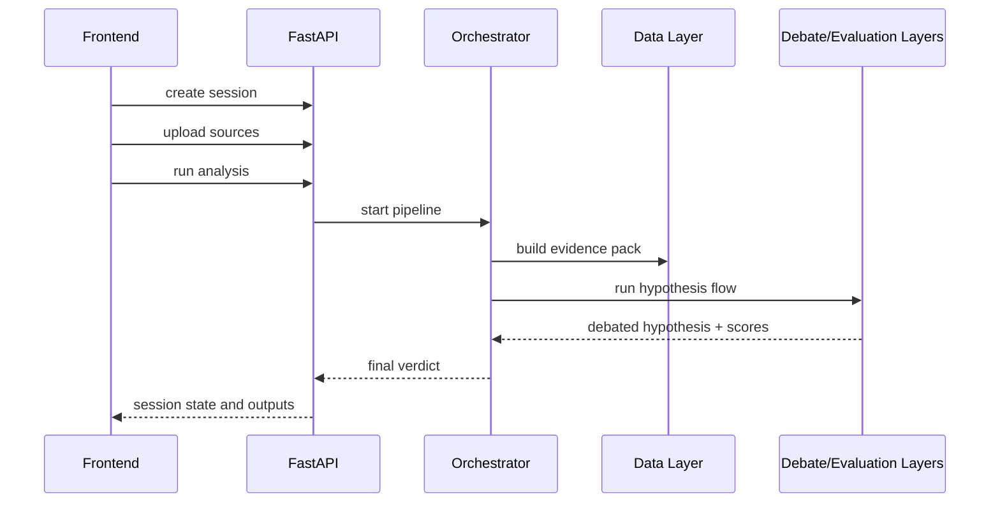

---
tags:
  - docs
  - architecture
  - backend
---

# Backend

## Роль backend

Backend выступает как API- и orchestration-layer платформы. Он управляет жизненным циклом research session, хранит артефакты гипотез и публикует состояние системы для frontend.

## Основные зоны ответственности

- intake исследовательской задачи;
- загрузка и регистрация документов;
- запуск hypothesis pipeline;
- хранение evidence, hypothesis versions и verdict;
- выдача структурированных данных в workspace UI.

## Логическая структура

```text
backend/app/
├── api/            - routes, request/response contracts
├── core/           - settings and cross-cutting config
├── schemas/        - typed payloads
├── services/       - application services
├── orchestrators/  - multi-step research flows
├── repositories/   - persistence access
├── models/         - domain entities
└── workers/        - long-running or async jobs
```

## Domain entities

- `research_session`
- `source_document`
- `document_chunk`
- `evidence_item`
- `hypothesis`
- `debate_round`
- `evaluation_result`
- `judge_verdict`

## Endpoint groups

- `health`
- `research sessions`
- `documents`
- `evidence`
- `hypotheses`
- `debates`
- `evaluations`
- `verdicts`

## Прикладной поток



## Правила backend-слоя

- HTTP-контракты остаются тонкими и typed.
- Оркестрация живёт отдельно от transport layer.
- LLM outputs нормализуются схемами.
- Все исследовательские артефакты сохраняются как session state.

## Связанные документы

- [[02-System-Architecture]]
- [[05-Data-and-Retrieval]]
- [[product/03-Hypothesis-Pipeline]]
