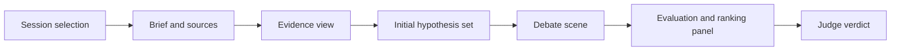

---
tags:
  - docs
  - architecture
  - frontend
---

# Frontend

## Роль frontend

Frontend организует research workspace, в котором пользователь ведёт сессию, видит initial hypothesis set, наблюдает debate по активной гипотезе, читает evidence и получает verdict.

## Основные UI-зоны

- session sidebar;
- hypothesis list;
- debate scene;
- evaluation and ranking panel;
- evidence and attachment panel;
- session composer.

## Функциональные блоки

```text
frontend/src/
├── app/        - app shell and providers
├── shared/     - common UI, utils and primitives
├── features/
│   ├── research-session/
│   ├── document-upload/
│   ├── evidence-viewer/
│   ├── hypothesis-list/
│   ├── debate-scene/
│   ├── evaluation-panel/
│   └── final-verdict/
└── pages/      - route-level compositions
```

## Пользовательские состояния

- `intake`
- `ingestion`
- `evidence-ready`
- `hypotheses-ready`
- `debating`
- `evaluating`
- `completed`

## Визуальный принцип

Интерфейс работает как сцена обсуждения, а не как корпоративная форма ввода.
Центральное место занимает активная гипотеза из current hypothesis set и её refinement through roles.

## Клиентский поток данных



## Интеграция с backend

- браузерный маршрут API проходит через `/api`;
- локальный frontend использует `VITE_API_BASE_URL`;
- session state синхронизируется через API-контракты backend.

## Связанные документы

- [[01-System-Overview]]
- [[06-Infrastructure]]
- [[product/05-Interface-and-Scene]]
