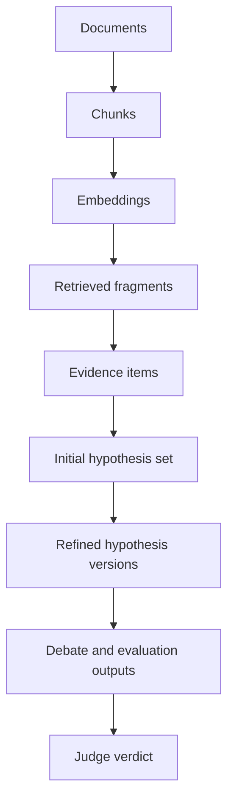

---
tags:
  - docs
  - architecture
  - data
  - retrieval
---

# Data and Retrieval

> [!abstract]
> Платформа работает вокруг evidence-centric data model: каждая стартовая гипотеза, её версия после debate, реплика и verdict привязаны к материалам, сигналам и версии исследовательской сессии.

## Входные данные

- научные статьи;
- внутренние отчёты;
- результаты экспериментов;
- служебные заметки;
- KPI;
- ограничения;
- пользовательские критерии оценки.

## Базовые сущности

### Source document

- тип источника;
- название;
- происхождение;
- метаданные;
- извлечённый текст.

### Document chunk

- ссылка на документ;
- позиция в документе;
- chunk text;
- embedding и retrieval metadata.

### Evidence item

- source reference;
- fragment reference;
- claim summary;
- signal type: `support`, `risk`, `contradiction`, `constraint`, `unknown`;
- relevance score.

### Hypothesis support map

- initial candidate reference;
- supporting evidence;
- contradictory evidence;
- unresolved gaps;
- relevance to KPI.

## Data flow

## Retrieval layer

Retrieval layer объединяет:

- semantic search;
- metadata filters;
- similarity and adjacency search;
- contradiction spotting;
- evidence ranking.

## Persistence model

Платформа использует:

- PostgreSQL как основное хранилище;
- pgvector для векторного поиска;
- session-bound records для evidence, hypotheses и verdicts.

## Explainability contract

Каждый важный вывод в системе можно проследить до:

- документа;
- фрагмента;
- evidence item;
- стартовой гипотезы;
- версии гипотезы;
- реплики роли;
- итогового verdict.

## Связанные документы

- [[02-System-Architecture]]
- [[03-Backend]]
- [[product/03-Hypothesis-Pipeline]]
- [[sources/Organizer-Materials/Hypothesis-Factory/01-Full-Spec]]
