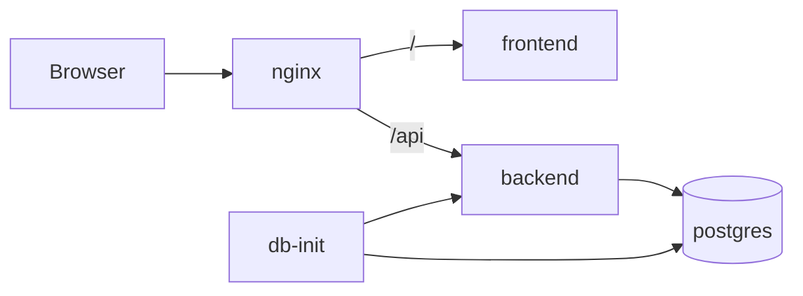

---
tags:
  - docs
  - architecture
  - infra
---

# Infrastructure

## Runtime topology

- `backend` обслуживает API и orchestration flow;
- `postgres` хранит identity, session state и исследовательские артефакты;
- `db-init` применяет миграции и запускает первичные seed-паки;
- `frontend` обслуживает workspace UI;
- `nginx` публикует единый внешний вход и маршрутизирует трафик;
- внешние порты задаются через `.env` и `docker-compose.override.yml`.

## Контур запуска

## Контейнерная модель

- отдельный Dockerfile у `backend`;
- отдельный Dockerfile у `frontend`;
- отдельный Dockerfile у `nginx`;
- отдельный сервис `postgres` в `docker-compose.yml`;
- отдельный сервис `db-init`, использующий backend image и отдельную startup-команду;
- `docker-compose.yml` собирает системный контур;
- `docker-compose.override.yml` задаёт локальные внешние порты.

## Environment layer

### Root env

- `NGINX_EXTERNAL_PORT`
- `BACKEND_EXTERNAL_PORT`
- `POSTGRES_DB`
- `POSTGRES_USER`
- `POSTGRES_PASSWORD`
- `BACKEND_CORS_ALLOW_ORIGINS`
- `AUTH_JWT_SECRET`
- `AUTH_ACCESS_TOKEN_TTL=1d`
- `AUTH_REFRESH_TOKEN_TTL=1w`
- `SUPERADMIN_USERNAME`
- `SUPERADMIN_PASSWORD`
- `SUPERADMIN_FIRST_NAME` - optional
- `SUPERADMIN_LAST_NAME` - optional
- `FRONTEND_ALLOWED_HOSTS`

### Frontend local env

- `VITE_API_BASE_URL`

## Runtime rules

- браузерный доступ идёт через `nginx`;
- API публикуется под `/api`;
- конфигурация доменов и портов живёт в env;
- схема БД поднимается только через Alembic migrations;
- `db-init` выполняется раньше прикладного backend-startup;
- bootstrap superadmin и seed-паки применяются идемпотентно;
- frontend и backend остаются развязаны на уровне внешнего URL.

## Связанные документы

- [[01-System-Overview]]
- [[03-Backend]]
- [[backend/04-Db-Init-and-Seeds]]
- [[database/01-Identity-and-Auth-Schema]]
- [[04-Frontend]]
