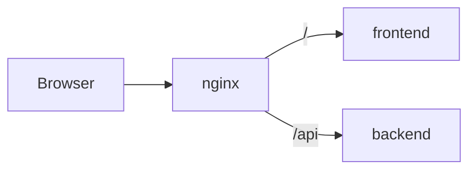

---
tags:
  - docs
  - architecture
  - infra
---

# Infrastructure

## Runtime topology

- `backend` обслуживает API и orchestration flow;
- `frontend` обслуживает workspace UI;
- `nginx` публикует единый внешний вход и маршрутизирует трафик;
- внешние порты задаются через `.env` и `docker-compose.override.yml`.

## Контур запуска

## Контейнерная модель

- отдельный Dockerfile у `backend`;
- отдельный Dockerfile у `frontend`;
- отдельный Dockerfile у `nginx`;
- `docker-compose.yml` собирает системный контур;
- `docker-compose.override.yml` задаёт локальные внешние порты.

## Environment layer

### Root env

- `NGINX_EXTERNAL_PORT`
- `BACKEND_EXTERNAL_PORT`
- `BACKEND_CORS_ALLOW_ORIGINS`
- `FRONTEND_ALLOWED_HOSTS`

### Frontend local env

- `VITE_API_BASE_URL`

## Runtime rules

- браузерный доступ идёт через `nginx`;
- API публикуется под `/api`;
- конфигурация доменов и портов живёт в env;
- frontend и backend остаются развязаны на уровне внешнего URL.

## Связанные документы

- [[01-System-Overview]]
- [[03-Backend]]
- [[04-Frontend]]
