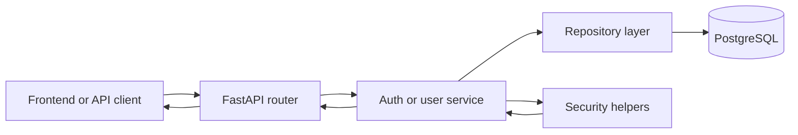

---
tags:
  - docs
  - architecture
  - backend
  - fastapi
---

# Обзор Backend

## Роль backend

Backend является прикладным центром платформы. Он одновременно:

- публикует HTTP API;
- аутентифицирует пользователей;
- управляет пользовательскими правами;
- оркестрирует исследовательский пайплайн;
- сохраняет состояние сессий, гипотез, debate и verdict.

## Архитектурное правило

Во всём backend-контуре действует единая граница ответственности:

```text
router -> service -> repository -> model/db
```

- `router` принимает HTTP, проверяет доступ и собирает response;
- `service` владеет бизнес-правилами, транзакциями и оркестрацией;
- `repository` делает только запросы и запись в БД;
- `model/db` задаёт фактическую структуру хранения.

## Пакетная структура

```text
backend/
├── alembic/                  - migrations и alembic environment
├── app/
│   ├── api/
│   │   ├── deps/             - auth dependencies и shared guards
│   │   ├── errors/           - HTTP error mapping
│   │   └── routers/          - health, auth, users, research endpoints
│   ├── core/                 - settings, env parsing, security config
│   ├── db/                   - engine, session factory, naming convention
│   ├── models/               - SQLAlchemy models и database enums
│   ├── repositories/         - persistence access
│   ├── schemas/              - Pydantic request/response contracts
│   ├── security/             - Argon2id, JWT, refresh token hashing
│   ├── services/             - auth service, user service, future domain services
│   ├── orchestrators/        - research flows
│   ├── seed/                 - bootstrap superadmin и static seed runners
│   └── workers/              - async и background jobs
└── seeds/                    - seed packs и manifests
```

## Стартовые backend-домены

### Platform

- `health` для liveness/readiness;
- конфигурация приложения;
- единая обработка ошибок;
- жизненный цикл приложения и подключение к БД.

### Identity and access

- login без регистрации;
- access и refresh tokens;
- revoke логики;
- bootstrap суперпользователя;
- аудит операций с пользователями.

### User management

- создание пользователей админом;
- редактирование профиля;
- смена пароля пользователем;
- reset пароля админом;
- логическое удаление пользователей.

### Research domain

- исследовательские сессии;
- документы и evidence;
- hypothesis pipeline;
- debate/evaluation/judge результаты.

## Прикладной поток identity



## Транзакционная модель

- login создаёт refresh session в одной прикладной транзакции;
- refresh rotation обновляет старую и создаёт новую сессию атомарно;
- admin create/update/delete user выполняется сервисом как единая операция;
- смена пароля одновременно обновляет hash, отзывает refresh sessions и повышает `token_version`.

## Границы безопасности

- пароли никогда не хранятся и не логируются в открытом виде;
- refresh token хранится только в виде hash;
- short-lived access token ограничивает окно риска;
- любой защищённый endpoint дополнительно проверяет текущий `token_version` пользователя.

## Связанные документы

- [[02-Authentication-and-Tokens]]
- [[03-Users-and-Admin]]
- [[04-Db-Init-and-Seeds]]
- [[../database/01-Identity-and-Auth-Schema]]
