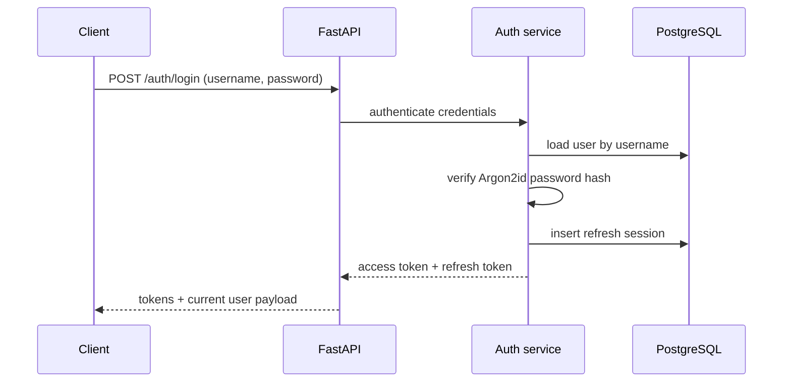
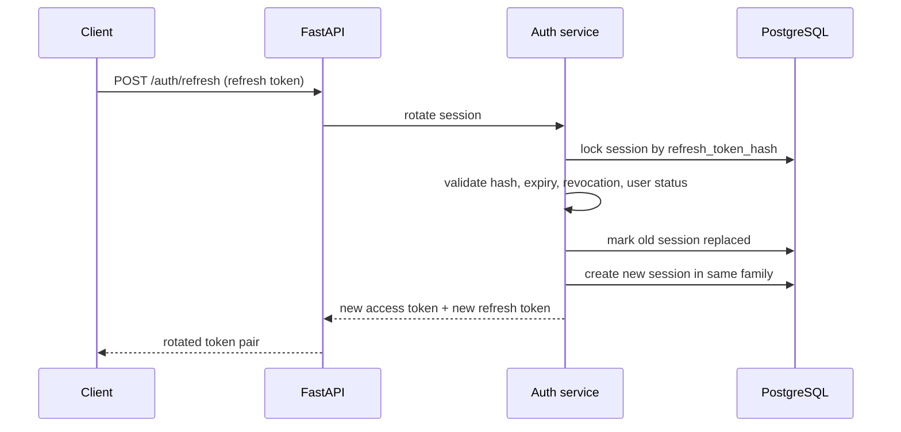
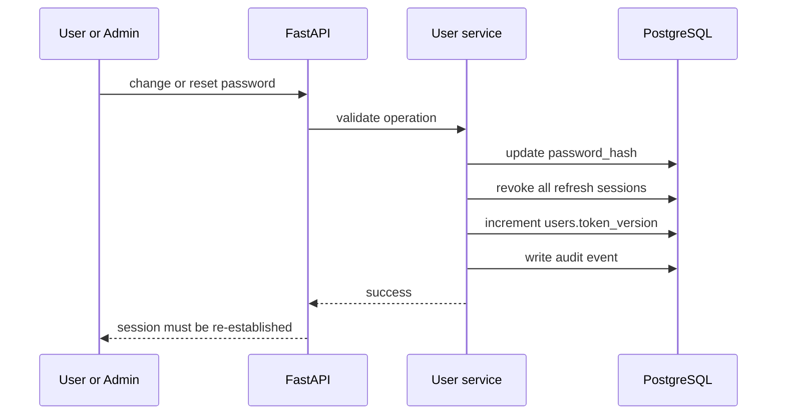

---
tags:
  - docs
  - architecture
  - backend
  - auth
---

# Аутентификация И Токены

> [!important]
> В системе нет публичной регистрации. Любой вход возможен только для пользователя, уже созданного суперпользователем или администратором.

## Поддерживаемые операции

- `POST /auth/login`
- `POST /auth/refresh`
- `POST /auth/logout`
- `POST /auth/logout-all`
- `GET /auth/me`

## Политика входа

Пользователь входит по `username` и `password`.
`username` хранится case-insensitive, поэтому `Admin`, `admin` и `ADMIN` считаются одним и тем же логином.

Login разрешён только если:

- пользователь существует;
- статус пользователя `active`;
- пароль совпадает;
- пользователь не удалён.

## Access Token

Access token реализован как JWT и используется для авторизации API-запросов.

### Содержимое access token

- `sub` — `user_id`;
- `session_id` — refresh session, из которой был выпущен текущий access token;
- `token_version` — версия токенов пользователя;
- `is_admin`;
- `is_superadmin`;
- `exp`, `iat`, `nbf`.

### Время жизни

- `AUTH_ACCESS_TOKEN_TTL=1d`

TTL хранится в `.env` именно строкой такого формата и парсится в backend-конфигурации.

## Refresh Token

Refresh token является непрозрачным случайным значением, а не JWT.
Клиент получает его один раз в ответе login/refresh, а в БД хранится только hash.

### Время жизни

- `AUTH_REFRESH_TOKEN_TTL=1w`

### Принципы хранения

- в БД сохраняется только `refresh_token_hash`;
- у каждой refresh session есть `family_id` для цепочки ротации;
- `parent_session_id` и `replaced_by_session_id` позволяют проследить lineage;
- повторное использование уже заменённого refresh token считается компрометацией семейства.

## Сценарий входа

## Ротация Refresh Token

Каждый `POST /auth/refresh` делает ротацию refresh session, а не повторно использует ту же запись.

## Обнаружение повторного использования

Если клиент повторно присылает refresh token, который уже был заменён, backend считает, что токен утёк.
В этом случае сервис:

- отзывает всю `family_id`;
- пишет событие в `audit_events`;
- требует новый login.

## Политика logout

### `POST /auth/logout`

- отзывает только текущую refresh session;
- текущий access token доживает свой короткий TTL, но больше не продлевается.

### `POST /auth/logout-all`

- отзывает все активные refresh sessions пользователя;
- повышает `token_version`, чтобы прежние access token перестали проходить проверку.

## Смена пароля и отзыв сессий

При любой смене пароля backend завершает все активные сессии пользователя.
Это относится и к self-service смене пароля, и к admin reset.

## Конфигурация auth

- `AUTH_JWT_SECRET`
- `AUTH_ACCESS_TOKEN_TTL=1d`
- `AUTH_REFRESH_TOKEN_TTL=1w`
- `AUTH_ISSUER`
- `AUTH_AUDIENCE`

## Связанные документы

- [[01-Backend-Overview]]
- [[03-Users-and-Admin]]
- [[../database/01-Identity-and-Auth-Schema]]
- [[../database/02-Constraints-Indexes-and-Checks]]
