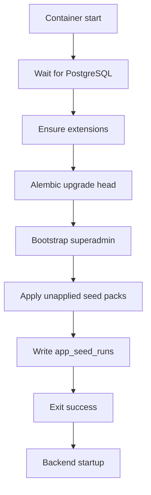

---
tags:
  - docs
  - architecture
  - backend
  - database
  - seed
---

# Db-Init И Seeds

> [!important]
> Схема базы данных поднимается только через Alembic migrations. `db-init` не использует `create_all` и не создаёт таблицы в обход миграций.

## Назначение сервиса

`db-init` является отдельным compose-сервисом, который выполняется при старте окружения и подготавливает БД к работе приложения.

## Что делает `db-init`

1. ждёт доступности PostgreSQL;
2. проверяет и включает необходимые extensions;
3. запускает `alembic upgrade head`;
4. применяет bootstrap суперпользователя из `.env`;
5. выполняет seed packs, которые ещё не были применены;
6. фиксирует результат в `app_seed_runs`;
7. завершается с кодом `0`, после чего backend может стартовать.

## Жизненный цикл



## Seed structure

```text
backend/
├── seeds/
│   ├── bootstrap/
│   │   └── 001-superadmin.yaml
│   └── reference/
│       └── 001-system-baseline.yaml
└── app/seed/
    ├── manifest.py
    ├── runner.py
    └── loaders/
```

## Идемпотентность

Каждый seed pack имеет собственный `seed_key`.
Если `seed_key` уже присутствует в `app_seed_runs`, пакет повторно не применяется.

Это даёт:

- безопасный повторный запуск контейнеров;
- предсказуемый bootstrap на новых стендах;
- отсутствие дублей в справочных данных.

## Bootstrap superadmin

`db-init` гарантирует существование одной системной учётной записи, которая берётся из `.env`.

Для обязательного bootstrap достаточно:

- `SUPERADMIN_USERNAME`
- `SUPERADMIN_PASSWORD`

Поля `SUPERADMIN_FIRST_NAME` и `SUPERADMIN_LAST_NAME` являются необязательными.

Поведение bootstrap:

- если пользователя нет, запись создаётся;
- если пользователь есть и это суперпользователь, запись синхронизируется с bootstrap-конфигурацией;
- если логин занят не-суперпользователем, `db-init` завершается ошибкой, чтобы не допустить неоднозначности доступа.

## Правило запуска в compose

- `postgres` стартует первым;
- `db-init` зависит от `postgres`;
- `backend` зависит от успешного завершения `db-init`;
- `frontend` и `nginx` могут стартовать после backend по обычной цепочке.

## Что входит в первые seed-паки

- bootstrap superadmin;
- системные baseline-настройки, которые должны существовать на любом окружении;
- служебные записи для контроля применённых seeds.

## Связанные документы

- [[02-Authentication-and-Tokens]]
- [[03-Users-and-Admin]]
- [[../06-Infrastructure]]
- [[../database/01-Identity-and-Auth-Schema]]
