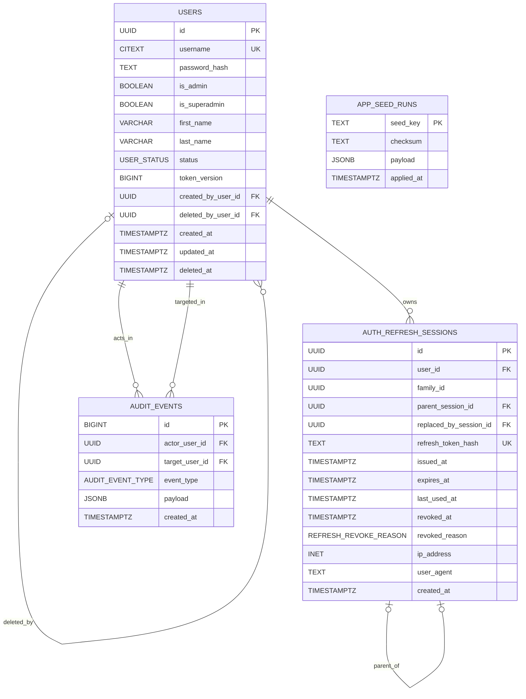
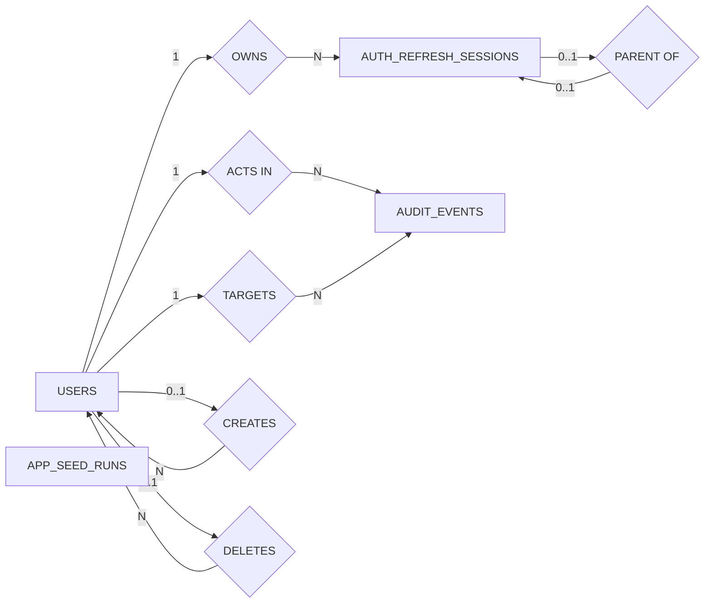

---
tags:
  - docs
  - architecture
  - database
  - auth
---

# Схема Identity И Auth

## База данных identity-контура

Для стартового backend-функционала используются четыре основные таблицы:

- `users`
- `auth_refresh_sessions`
- `audit_events`
- `app_seed_runs`

## PostgreSQL extensions

- `citext` — case-insensitive `username`
- `pgcrypto` — `gen_random_uuid()`
- `pgvector` — включается в основном research-контуре, но не обязателен для identity-модуля

## ER-диаграмма

## Нотация Чена

## Таблица `users`

### Назначение

Хранит все внутренние учётные записи платформы.

### Поля

| Поле | Тип | Назначение |
| --- | --- | --- |
| `id` | `uuid` | первичный ключ |
| `username` | `citext` | уникальный логин без чувствительности к регистру |
| `password_hash` | `text` | Argon2id hash |
| `is_admin` | `boolean` | административный доступ |
| `is_superadmin` | `boolean` | системный суперпользователь |
| `first_name` | `varchar(100)` | необязательное имя |
| `last_name` | `varchar(100)` | необязательная фамилия |
| `status` | `user_status` | `active`, `inactive`, `deleted` |
| `token_version` | `bigint` | версия access token |
| `created_by_user_id` | `uuid` | кто создал пользователя |
| `deleted_by_user_id` | `uuid` | кто удалил пользователя |
| `created_at` | `timestamptz` | время создания |
| `updated_at` | `timestamptz` | время обновления |
| `deleted_at` | `timestamptz` | время логического удаления |

## Таблица `auth_refresh_sessions`

### Назначение

Хранит каждую refresh session как отдельную запись, чтобы backend мог:

- делать безопасную ротацию refresh token;
- отзывать отдельную сессию или все сессии пользователя;
- обнаруживать reuse скомпрометированного токена.

### Поля

| Поле | Тип | Назначение |
| --- | --- | --- |
| `id` | `uuid` | первичный ключ сессии |
| `user_id` | `uuid` | владелец сессии |
| `family_id` | `uuid` | семейство ротации |
| `parent_session_id` | `uuid` | предыдущая сессия в цепочке |
| `replaced_by_session_id` | `uuid` | следующая сессия после rotation |
| `refresh_token_hash` | `text` | hash refresh token |
| `issued_at` | `timestamptz` | момент выдачи |
| `expires_at` | `timestamptz` | срок действия |
| `last_used_at` | `timestamptz` | последнее использование |
| `revoked_at` | `timestamptz` | момент отзыва |
| `revoked_reason` | `refresh_revoke_reason` | причина отзыва |
| `ip_address` | `inet` | IP клиента |
| `user_agent` | `text` | user agent клиента |
| `created_at` | `timestamptz` | время создания записи |

## Таблица `audit_events`

### Назначение

Неизменяемый журнал действий безопасности и администрирования.

### Поля

| Поле | Тип | Назначение |
| --- | --- | --- |
| `id` | `bigint` | монотонный идентификатор события |
| `actor_user_id` | `uuid` | кто совершил действие |
| `target_user_id` | `uuid` | к кому относится действие |
| `event_type` | `audit_event_type` | тип события |
| `payload` | `jsonb` | структурированный контекст |
| `created_at` | `timestamptz` | время события |

## Таблица `app_seed_runs`

### Назначение

Фиксирует, какие seed-паки уже были применены сервисом `db-init`.

### Поля

| Поле | Тип | Назначение |
| --- | --- | --- |
| `seed_key` | `text` | уникальный ключ seed-пакета |
| `checksum` | `text` | контрольная сумма содержимого |
| `payload` | `jsonb` | служебные детали применения |
| `applied_at` | `timestamptz` | время применения |

## Enums базы данных

### `user_status`

- `active`
- `inactive`
- `deleted`

### `refresh_revoke_reason`

- `logout`
- `logout_all`
- `password_changed`
- `admin_reset`
- `admin_delete`
- `rotation_replaced`
- `reuse_detected`

### `audit_event_type`

- `user_created`
- `user_updated`
- `user_deleted`
- `password_changed`
- `password_reset`
- `login_success`
- `login_failed`
- `logout`
- `logout_all`
- `refresh_rotated`
- `refresh_reuse_detected`

## Связанные документы

- [[../backend/02-Authentication-and-Tokens]]
- [[../backend/03-Users-and-Admin]]
- [[02-Constraints-Indexes-and-Checks]]
