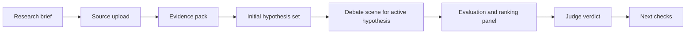

---
tags:
  - docs
  - product
  - user-flow
---

# User Flow

## Канонический сценарий

1. Пользователь создаёт исследовательскую сессию.
2. Формулирует KPI, ограничения и контекст задачи.
3. Загружает материалы.
4. Изучает собранный evidence pack.
5. Получает стартовый набор гипотез.
6. Наблюдает debate loop и версионность активной гипотезы.
7. Изучает независимую оценку и ranking вариантов.
8. Получает verdict judge и список первоочередных проверок.

## Flow

## Что пользователь видит на каждом шаге

| Шаг | Что видит пользователь | Зачем это нужно |
| --- | --- | --- |
| Intake | KPI, ограничения, описание контекста | Сессия остаётся привязанной к реальной исследовательской задаче |
| Evidence | Поднятые документы, фрагменты и сигналы | Видно, из чего родилась гипотеза |
| Hypothesis | Короткий набор стартовых гипотез | Видно, какие варианты система вообще предлагает |
| Debate | Активную гипотезу, реплики ролей и правки версий | Видно, как каждый вариант усиливается и очищается |
| Evaluation | Независимые критерии и ranking | Риск, стоимость и ценность не смешиваются и сравниваются |
| Verdict | Итоговый приоритет и первый шаг проверки | Решение готово к практическому действию |

## Базовые сущности интерфейса

- `Research Session`
- `Source Document`
- `Evidence Item`
- `Initial Hypothesis Set`
- `Hypothesis Version`
- `Debate Round`
- `Evaluation Result`
- `Judge Verdict`

## Пользовательская ценность траектории

> [!tip]
> Пользователь видит не только финал, но и весь путь вариантов: от evidence до стартового hypothesis set, debate по каждой гипотезе и финальной оценки.

## Связанные документы

- [[03-Hypothesis-Pipeline]]
- [[04-Agents-and-Judge]]
- [[05-Interface-and-Scene]]
