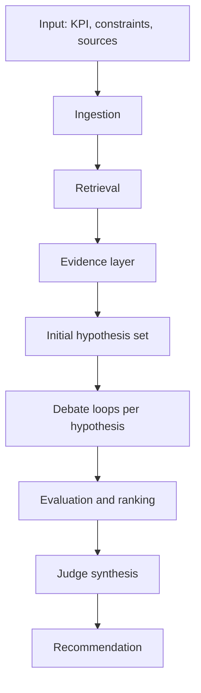

---
tags:
  - docs
  - product
  - pipeline
---

# Hypothesis Pipeline

> [!abstract]
> Hypothesis pipeline связывает knowledge ingestion, retrieval, generation of `3-5` initial hypotheses, debate per hypothesis and evaluation в один объяснимый контур.

## Верхнеуровневая схема

## Этап 1. Ingestion

Система принимает:

- научные статьи;
- внутренние отчёты;
- результаты экспериментов;
- служебные заметки;
- KPI и ограничения.

Результат:

- документы нормализованы;
- метаданные сохранены;
- контент подготовлен к search и citation.

## Этап 2. Retrieval

Система поднимает:

- релевантные факты;
- сигналы пользы и риска;
- исторические удачи и провалы;
- противоречия между источниками;
- участки, где данных недостаточно.

Результат:

- evidence pack, привязанный к конкретной сессии.

## Этап 3. Initial hypotheses

Hypothesis engine формирует стартовый набор из `3-5` гипотез.
Точное число задаётся в pipeline settings.

Каждая стартовая гипотеза:

- связана с KPI;
- проверяема;
- содержит механизм влияния;
- опирается на evidence;
- учитывает ограничения.

## Этап 4. Debate loop

Каждая гипотеза из initial set проходит свой цикл:

1. `Defender` усиливает и формулирует сильные стороны.
2. `Attacker` вскрывает логические и доказательные слабости.
3. `Manufacturer` проверяет реализуемость в реальных условиях.
4. Система выпускает новую версию гипотезы.
5. Цикл повторяется до завершения refinement или round limit.

Результат:

- refined hypothesis set;
- history of changes per hypothesis;
- debate transcript;
- argument map.

## Этап 5. Evaluation layer

После debate каждая refined hypothesis оценивается независимо:

- `Finance`
- `Risk`
- дополнительные evaluators по критериям пользователя

Каждый evaluator возвращает:

- краткий вывод;
- оценку по своему критерию;
- ключевые факторы;
- замечания и boundary conditions.

Дополнительно evaluation layer собирает сравнительный ranking между гипотезами.

## Этап 6. Judge synthesis

Judge агрегирует:

- refined hypothesis set;
- outputs evaluators;
- evidence highlights;
- unresolved risks.

Judge verdict содержит:

- ranking гипотез;
- приоритет финальной рекомендации;
- сильные стороны;
- слабые стороны;
- уровень риска;
- ожидаемую ценность;
- рекомендованный первый эксперимент или первый шаг проверки.

## Артефакты пайплайна

- `research_brief`
- `evidence_pack`
- `initial_hypothesis_set`
- `hypothesis_versions`
- `debate_transcript`
- `evaluation_sheet`
- `ranking_sheet`
- `final_recommendation`

## Связанные документы

- [[04-Agents-and-Judge]]
- [[architecture/03-Backend]]
- [[architecture/05-Data-and-Retrieval]]
