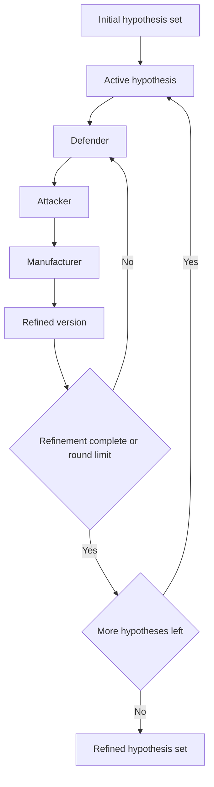

---
tags:
  - docs
  - product
  - agents
---

# Agents and Judge

> [!important]
> Сначала hypothesis engine выпускает стартовый набор из `3-5` гипотез. Внутри одного debate loop роли обсуждают одну активную гипотезу. Debate layer не расширяет hypothesis set, а уточняет уже созданные варианты.

## Ролевой состав

### Debate layer

- `Defender`
- `Attacker`
- `Manufacturer`

### Evaluation layer

- `Finance`
- `Risk`
- дополнительные evaluators по критериям пользователя

### Final synthesis

- `Judge`

## Роли debate layer

### Defender

Роль:

- усиливает гипотезу;
- подтягивает supporting evidence;
- формулирует, почему гипотеза заслуживает дальнейшей проверки.

### Attacker

Роль:

- ищет противоречия;
- отмечает слабые места аргументации;
- отделяет правдоподобие от надёжной обоснованности;
- фиксирует неизвестные и хрупкие зоны.

### Manufacturer

Роль:

- проверяет технологическую реализуемость;
- соотносит гипотезу с производственными ограничениями;
- выбивает из гипотезы всё, что красиво звучит, но не переносится в практику.

## Логика debate loop

## Evaluation layer

Evaluators работают независимо друг от друга.
Каждая роль смотрит на refined hypothesis set и возвращает собственную structured assessment по каждой гипотезе.

Примеры дополнительных evaluators:

- `Ecology`
- `Safety`
- `Scalability`
- `Patent Clearance`
- `Import Substitution`

## Judge

Judge собирает:

- refined hypothesis set;
- все evaluator outputs;
- ключевые evidence items;
- remaining risks.

Judge выпускает:

- verdict;
- ranking hypotheses;
- приоритет;
- краткое executive summary;
- список сильных сторон;
- список слабых сторон;
- recommended next check.

## Стабильные правила платформы

> [!check]
> Эти правила определяют поведение агентной системы:

- custom evaluators живут в evaluation layer;
- hypothesis engine формирует count стартовых гипотез из pipeline settings;
- debate layer отвечает за refinement активной гипотезы и не создаёт новые ветки идей;
- evaluation layer отвечает за независимую оценку и ranking;
- round limit debate loop задаётся в pipeline settings;
- judge синтезирует выводы и закрывает сессию verdict.

## Связанные документы

- [[03-Hypothesis-Pipeline]]
- [[05-Interface-and-Scene]]
- [[sources/Organizer-Materials/Hypothesis-Factory/01-Full-Spec]]
