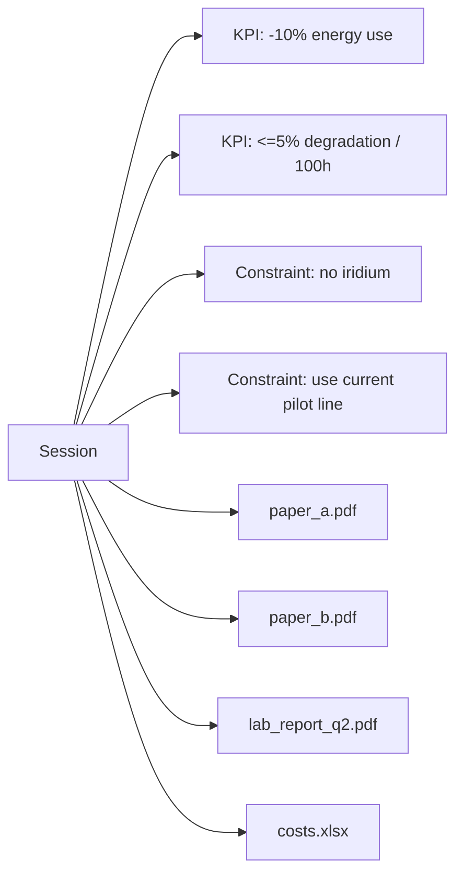
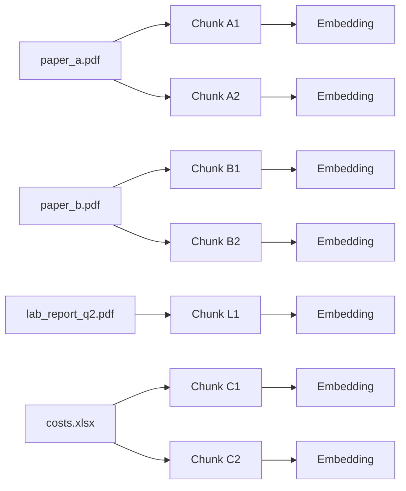
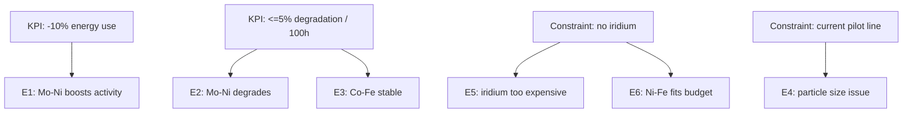
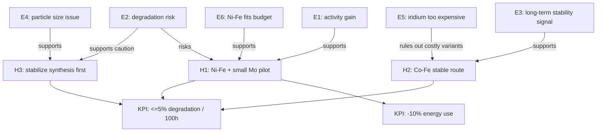
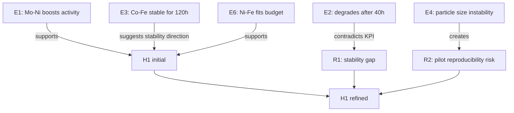
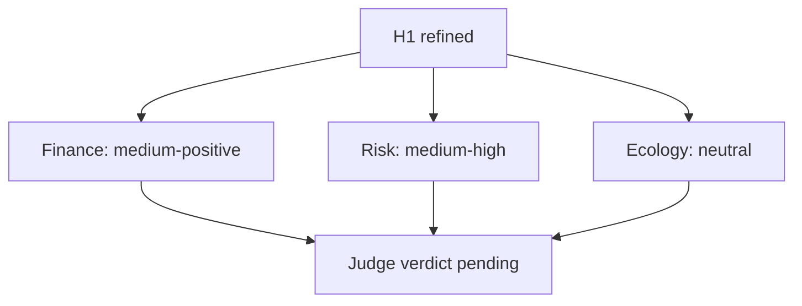
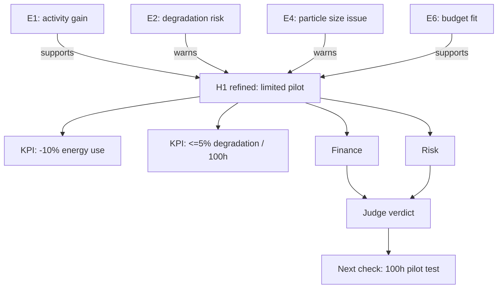

---
tags:
  - docs
  - product
  - walkthrough
  - example
---

# Session Walkthrough

> [!abstract]
> Этот файл показывает один реалистичный проход по Hypothesis Court: от загрузки файлов до финального verdict. Цель примера — наглядно объяснить, как text chunks, embeddings, evidence, debate и graph работают вместе.

## Зачем нужен этот пример

Важно не путать две разные вещи:

- `embedding` (вектор смысла) помогает искать похожие по смыслу фрагменты текста;
- `graph` (схема связей) помогает показать, что с чем связано.

`Embedding` не превращает текст в graph напрямую.
Сначала система режет документы на фрагменты, делает embeddings, находит нужные фрагменты, а уже потом собирает из важных объектов простую карту связей.

## Кейс

Пользователь хочет понять, стоит ли запускать проект по разработке катализатора для щелочного электролиза при низких температурах.

### Что вводит пользователь

- `KPI` (измеримая цель): снизить энергопотребление электролизной ячейки на `10%`.
- `KPI` (измеримая цель): удержать деградацию катализатора не выше `5%` за `100` часов.
- `constraint` (ограничение): не использовать дорогие иридиевые прекурсоры.
- `constraint` (ограничение): запускаться на существующей пилотной линии без покупки новой печи.
- `sources` (исходные материалы): две статьи, один внутренний отчёт, одна таблица себестоимости.

### Какие файлы загружаются

1. `paper_a.pdf`
   Оксид никеля с добавкой молибдена даёт хороший стартовый ток при `60-80 C`, но деградирует при циклировании.
2. `paper_b.pdf`
   Кобальт-железная шпинель слабее на старте, но стабильнее в длительном тесте.
3. `lab_report_q2.pdf`
   На пилотной линии уже пробовали молибденовый маршрут, но получили нестабильный размер частиц.
4. `costs.xlsx`
   Иридиевые прекурсоры сильно ухудшают экономику, а никель и железо укладываются в бюджет.

## Шаг 1. Intake

На этом этапе система ещё ничего не ищет. Она просто фиксирует задачу и привязывает к ней будущие действия.

### Что видит пользователь

- текст задачи;
- поля `KPI`;
- поля ограничений;
- список прикреплённых файлов;
- кнопка `Старт`.

### Что хранит система

- `research session` (одна исследовательская сессия);
- `research brief` (краткое формализованное описание задачи);
- список документов.

### Состояние graph

На старте graph очень простой. В нём ещё нет доказательств и гипотез.



### Переписка агентов

Её ещё нет. Агенты ещё не начали работать.

## Шаг 2. Parse, chunks и embeddings

После нажатия `Старт` система:

1. извлекает текст из файлов;
2. режет текст на `chunks` (небольшие фрагменты);
3. делает для каждого chunk `embedding` (вектор смысла);
4. сохраняет chunk, ссылку на файл и позицию внутри файла.

### Как это выглядит очень просто

Из `paper_a.pdf` система может сделать такие chunks:

- `A1`: "Mo-doped nickel oxide shows improved current density at 70 C."
- `A2`: "Activity decays after 40 hours under cyclic load."

Из `paper_b.pdf`:

- `B1`: "Co-Fe spinel shows lower initial activity."
- `B2`: "Performance remains stable through 120 hours."

Из `lab_report_q2.pdf`:

- `L1`: "Particle size distribution was unstable on the pilot synthesis line."

Из `costs.xlsx`:

- `C1`: "Iridium precursor increases catalyst cost by 38%."
- `C2`: "Nickel and iron route remains within pilot budget."

### Что важно понять

`Embedding model` (модель для перевода текста в вектор) работает с каждым chunk отдельно.
Она не говорит: "это уже факт" или "это уже гипотеза".
Она только помогает потом найти похожий по смыслу текст.

### Состояние graph

На этом этапе можно показать не смысловой graph, а техническую цепочку данных.



### Что видит пользователь

- статус `ingestion` (идёт обработка);
- индикатор прогресса;
- список файлов с меткой `parsed`.

### Переписка агентов

Её ещё нет. Сначала система должна собрать основание для разговора.

## Шаг 3. Retrieval и evidence

Теперь система берёт задачу пользователя и ищет по embeddings фрагменты, которые ближе всего по смыслу к:

- низкотемпературному электролизу;
- снижению энергопотребления;
- стабильности катализатора;
- бюджетным ограничениям;
- производственной реализуемости.

Из найденных chunks она собирает `evidence items` (единицы доказательной базы).

### Какие evidence items получились

1. `E1 support` (поддержка):
   Молибденовый никелевый катализатор улучшает стартовую активность.
   Источник: `paper_a.pdf`, chunk `A1`.
2. `E2 risk` (риск):
   Та же система деградирует под циклической нагрузкой.
   Источник: `paper_a.pdf`, chunk `A2`.
3. `E3 support`:
   Кобальт-железная шпинель стабильна на длинном тесте.
   Источник: `paper_b.pdf`, chunk `B2`.
4. `E4 constraint` (ограничение):
   На текущей пилотной линии уже была проблема с размером частиц.
   Источник: `lab_report_q2.pdf`, chunk `L1`.
5. `E5 risk`:
   Иридий делает проект слишком дорогим.
   Источник: `costs.xlsx`, chunk `C1`.
6. `E6 support`:
   Никель-железный маршрут укладывается в бюджет.
   Источник: `costs.xlsx`, chunk `C2`.

### Что видит пользователь

- справа список найденных фрагментов;
- у каждого фрагмента есть тип: `support`, `risk`, `constraint`;
- по наведению виден кусок текста;
- по клику открывается файл на нужном месте.

### Состояние graph

Теперь появляется первый полезный graph: не про агентов, а про доказательства.



### Переписка агентов

Её ещё нет, но теперь у системы уже есть материал для первой гипотезы.

## Шаг 4. Initial hypotheses

На основе evidence система выпускает не одну, а `3-5` стартовых гипотез.
Точное число задаётся в `admin panel` (панель администрирования).

В этом примере система настроена на `3` гипотезы.

### Hypothesis set v1

1. `H1`
   Запустить пилот по никель-железному катализатору с малой добавкой молибдена.
2. `H2`
   Не использовать молибден, а пойти в сторону более стабильной кобальт-железной системы.
3. `H3`
   Не запускать новый состав сразу, а сначала стабилизировать процесс синтеза на текущей линии и только потом возвращаться к каталитической оптимизации.

### Почему система выдала именно эти варианты

- `paper_a.pdf` даёт сигнал, что молибденовый маршрут может помочь по активности;
- `paper_b.pdf` даёт альтернативный маршрут через стабильность;
- `lab_report_q2.pdf` поднимает идею, что проблема может быть не только в химии, но и в воспроизводимости производства;
- `costs.xlsx` отрезает дорогие варианты и держит фокус на бюджетных маршрутах.

### Что видит пользователь

- список из `3` гипотез;
- у каждой есть краткое описание;
- у каждой есть supporting evidence (поддерживающие основания), risks (риски) и constraints (ограничения);
- возле списка видно, что количество стартовых гипотез берётся из настроек системы.

### Состояние graph

Теперь в graph появляются не одна, а несколько стартовых гипотез.



### Переписка агентов

Пока есть только системная запись:

```text
System:
Initial hypotheses created: 3.
Hypotheses are ready for debate.
Debate loop limit is configured in admin settings.
```

## Шаг 5. Debate

Теперь начинается не свободный чат, а управляемый `debate loop` (цикл спора ролей).
Важно: debate идёт не "над всеми сразу в одной каше", а по каждой гипотезе отдельно.

В примере ниже показан один цикл для `H1`.
Для `H2` и `H3` система делает такой же проход.

### Как система понимает, когда остановиться

Есть два стоп-правила:

1. роли больше не добавляют существенных изменений;
2. достигнут лимит раундов.

Лимит раундов тоже задаётся в `admin panel`.
Например, можно поставить `5`, `8` или `10`.

### Реплика 1. Defender

```text
Defender:
Гипотеза заслуживает проверки.
Ссылка [paper_a.pdf:A1] показывает рост активности при 70 C.
Ссылка [costs.xlsx:C2] показывает, что Ni-Fe маршрут остаётся в рамках бюджета.
Если уменьшить долю Mo и не уходить в дорогие прекурсоры, можно получить выигрыш по KPI
без немедленного выхода за cost ceiling.
```

### Реплика 2. Attacker

```text
Attacker:
Гипотеза пока слаба по стабильности.
Ссылка [paper_a.pdf:A2] говорит о деградации после 40 часов под циклической нагрузкой.
Это прямо конфликтует с KPI по <=5% degradation / 100h.
Кроме того, evidence по длительной стабильности относится не к той же самой композиции, а к Co-Fe spinel.
```

### Реплика 3. Manufacturer

```text
Manufacturer:
Есть производственный риск.
Ссылка [lab_report_q2.pdf:L1] показывает, что на пилотной линии уже была проблема
с размером частиц для Mo-маршрута.
Перед запуском большого проекта нужен малый синтез с проверкой воспроизводимости
и окна температур на существующей печи.
```

### Что видит пользователь

- последовательность сообщений ролей;
- возле каждой ссылки можно навести мышку и увидеть фрагмент;
- можно открыть источник прямо на нужном месте;
- справа обновляется список новых risks и unresolved gaps (нерешённых пробелов).

### Состояние graph после debate

Graph становится богаче: в нём появляются не только support, но и contradiction.



### Что меняется в гипотезе

После debate система выпускает улучшенную версию именно этой гипотезы.

> `H1 refined`: не запускать полный проект сразу. Сначала провести ограниченный пилот по никель-железной системе с малой добавкой молибдена, отдельно проверив деградацию при циклировании и воспроизводимость размера частиц на текущей пилотной линии.

Тут важно: debate не создал "другую вселенную".
Он уточнил и ужесточил исходную гипотезу.

### Что происходит с остальными гипотезами

- `H2` тоже проходит свой цикл debate;
- `H3` тоже проходит свой цикл debate;
- после этого у системы есть набор уже уточнённых гипотез, а не сырой список идей.

## Шаг 6. Evaluation

Теперь независимые `evaluators` (оценщики) смотрят уже не на сырые файлы, а на набор уточнённых гипотез.

В этом walkthrough для простоты показана оценка только `H1 refined`.

### Реплика Finance

```text
Finance:
Полный проект сейчас рискован.
Ni-Fe route экономически выглядит допустимо, но только если не появится дорогая стадия
дополнительной очистки и если Mo остаётся малой добавкой.
Предлагаю оценку: medium-positive.
```

### Реплика Risk

```text
Risk:
Главная угроза не в закупке, а в стабильности и воспроизводимости.
Есть прямой сигнал деградации и один внутренний сигнал производственной нестабильности.
Предлагаю оценку: medium-high risk before pilot.
```

### Реплика Ecology

```text
Ecology:
Серьёзных новых экологических барьеров по этим материалам не видно,
но полный вывод невозможен без данных о побочных продуктах синтеза.
Предлагаю оценку: neutral.
```

### Что видит пользователь

- карточки оценщиков;
- короткую оценку;
- факторы "за" и "против";
- цветовой статус по каждому evaluator.

### Состояние graph после evaluation



## Шаг 7. Judge verdict

Judge собирает:

- уточнённые гипотезы после debate;
- evidence;
- реплики debate;
- оценки evaluators.

### Финальный verdict

```text
Judge:
Рекомендация: не запускать полный проект немедленно.
Запустить ограниченный пилот по Ni-Fe catalyst route с малой добавкой Mo.

Причины:
1. Есть сигнал потенциального выигрыша по активности.
2. Бюджетные ограничения пока не нарушаются.
3. Есть незакрытый риск деградации при циклировании.
4. Есть производственный риск по размеру частиц на текущей линии.

Первый следующий шаг:
сделать малый цикл синтеза и 100-часовой тест деградации до решения о расширении.
```

### Что видит пользователь

- финальный текст решения;
- приоритет;
- список сильных сторон;
- список слабых сторон;
- рекомендуемый следующий эксперимент.

### Состояние graph в финале



## Что важно понять после примера

### 1. Что именно превращается в embeddings

Не весь "смысл проекта".
В embeddings превращаются обычные `chunks` (кусочки текста).

### 2. Что является node в graph

Node — это не обязательно кусок текста.
В нашем примере node может быть:

- `KPI`;
- `constraint`;
- документ;
- chunk;
- evidence item;
- hypothesis;
- risk;
- verdict.

### 3. Кто строит что

- `embedding model` делает embeddings для text chunks;
- `retrieval layer` находит похожие chunks;
- `evidence layer` собирает из них support, risk и contradiction;
- `hypothesis engine` строит гипотезу;
- `hypothesis engine` строит стартовый набор из `3-5` гипотез;
- `debate roles` уточняют гипотезу;
- `evaluators` считают независимые оценки;
- `judge` выпускает финальное решение;
- `graph view` просто визуализирует уже найденные связи.

### 4. Нужен ли live graph

Не обязательно.
Для первой рабочей версии полезнее:

- ссылки на источники в репликах;
- preview по наведению;
- открытие фрагмента в документе;
- простой graph, который обновляется по этапам сессии.

## Связанные документы

- [[02-User-Flow]]
- [[03-Hypothesis-Pipeline]]
- [[04-Agents-and-Judge]]
- [[05-Interface-and-Scene]]
- [[architecture/05-Data-and-Retrieval]]
